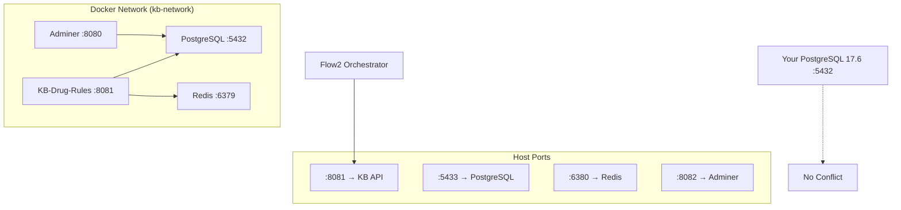

# 🐳 Docker Setup for KB-Drug-Rules Service

This setup creates **isolated Docker containers** for the KB-Drug-Rules service, avoiding conflicts with your existing PostgreSQL 17.6.

## 🚀 **Quick Start (2 minutes)**

### **Step 1: Start KB Service**
```bash
cd backend/services/knowledge-base-services
make run-kb-docker
```

**That's it!** The script will:
- ✅ Start PostgreSQL on port **5433** (isolated from your PostgreSQL 17.6)
- ✅ Start Redis on port **6380**
- ✅ Start KB-Drug-Rules service on port **8081**
- ✅ Load sample drug data automatically
- ✅ Start Adminer (database UI) on port **8082**

### **Step 2: Test the Service**
```bash
# Health check
curl http://localhost:8081/health

# Get drug rules
curl http://localhost:8081/v1/items/metformin
```

## 🎯 **What You Get**

### **Services Running:**
| Service | Port | URL | Purpose |
|---------|------|-----|---------|
| **KB-Drug-Rules** | 8081 | http://localhost:8081 | Main API service |
| **PostgreSQL** | 5433 | localhost:5433 | Database (isolated) |
| **Redis** | 6380 | localhost:6380 | Cache |
| **Adminer** | 8082 | http://localhost:8082 | Database UI |

### **Sample Data Included:**
- ✅ **Metformin** (diabetes medication)
- ✅ **Lisinopril** (blood pressure medication)
- ✅ **Warfarin** (anticoagulant)

### **API Endpoints:**
```bash
GET  /health                    # Health check
GET  /v1/items/{drug_id}       # Get drug rules
POST /v1/validate              # Validate TOML rules
POST /v1/hotload               # Hot-load new rules
GET  /metrics                  # Prometheus metrics
```

## 🔧 **Database Connection**

### **Connection Details:**
- **Host:** localhost
- **Port:** 5433 (isolated from your PostgreSQL 17.6 on 5432)
- **Database:** kb_drug_rules
- **Username:** kb_drug_rules_user
- **Password:** kb_password

### **Connect via Command Line:**
```bash
# Using Docker PostgreSQL (port 5433)
psql -U kb_drug_rules_user -h localhost -p 5433 -d kb_drug_rules
# Password: kb_password
```

### **Connect via Adminer UI:**
1. Go to: http://localhost:8082
2. **System:** PostgreSQL
3. **Server:** kb-postgres
4. **Username:** kb_drug_rules_user
5. **Password:** kb_password
6. **Database:** kb_drug_rules

## 🛠️ **Management Commands**

```bash
# Start KB services
make run-kb-docker

# Stop KB services
make stop-kb

# View logs
make logs-kb

# Check health
curl http://localhost:8081/health

# Test API
curl http://localhost:8081/v1/items/metformin
```

## 🧪 **Testing Your Setup**

### **1. Health Check**
```bash
curl http://localhost:8081/health
```

Expected response:
```json
{
  "status": "healthy",
  "timestamp": "2024-01-01T12:00:00Z",
  "checks": {
    "database": "healthy",
    "cache": "healthy"
  }
}
```

### **2. Get Drug Rules**
```bash
curl http://localhost:8081/v1/items/metformin
```

Expected response:
```json
{
  "drug_id": "metformin",
  "version": "1.0.0",
  "signature_valid": true,
  "regions": ["US", "EU"],
  "content": {
    "meta": {
      "drug_name": "Metformin",
      "therapeutic_class": ["Antidiabetic", "Biguanide"]
    },
    "dose_calculation": {
      "base_formula": "500mg BID",
      "max_daily_dose": 2000,
      "min_daily_dose": 500
    }
  }
}
```

### **3. Validate TOML Rules**
```bash
curl -X POST http://localhost:8081/v1/validate \
  -H "Content-Type: application/json" \
  -d '{
    "content": "[meta]\ndrug_name=\"Test Drug\"\ntherapeutic_class=[\"Test\"]\n[dose_calculation]\nbase_formula=\"100mg daily\"\nmax_daily_dose=200.0\nmin_daily_dose=50.0\n[safety_verification]\ncontraindications=[]\nwarnings=[]\nprecautions=[]\ninteraction_checks=[]\nlab_monitoring=[]\nmonitoring_requirements=[]\nregional_variations={}",
    "regions": ["US"]
  }'
```

## 🔗 **Flow2 Integration**

Your Flow2 orchestrator can now call the KB service:

```go
// Example Go client
type KBClient struct {
    baseURL string
}

func NewKBClient() *KBClient {
    return &KBClient{
        baseURL: "http://localhost:8081",
    }
}

func (k *KBClient) GetDrugRules(drugID, version, region string) (*DrugRules, error) {
    url := fmt.Sprintf("%s/v1/items/%s?version=%s&region=%s", 
        k.baseURL, drugID, version, region)
    
    resp, err := http.Get(url)
    if err != nil {
        return nil, err
    }
    defer resp.Body.Close()
    
    var rules DrugRules
    return &rules, json.NewDecoder(resp.Body).Decode(&rules)
}

// Usage in Flow2
kbClient := NewKBClient()
rules, err := kbClient.GetDrugRules("metformin", "1.0.0", "US")
if err != nil {
    return err
}

// Use rules for dose calculation
dose := calculateDose(rules.Content.DoseCalculation, patientContext)
```

## 🐳 **Docker Architecture**



## 🛠️ **Troubleshooting**

### **Docker Issues**
```bash
# Check if Docker is running
docker --version
docker info

# Check container status
docker ps

# View container logs
docker logs kb-drug-rules
docker logs kb-postgres
```

### **Port Conflicts**
If you get port conflicts:
1. **Port 8081**: Change in docker-compose.kb-only.yml
2. **Port 5433**: Change PostgreSQL port mapping
3. **Port 6380**: Change Redis port mapping

### **Service Not Starting**
```bash
# Check logs
make logs-kb

# Restart services
make stop-kb
make run-kb-docker

# Check health
curl http://localhost:8081/health
```

### **Database Connection Issues**
```bash
# Test PostgreSQL directly
docker exec -it kb-postgres psql -U postgres

# Check if database exists
docker exec kb-postgres psql -U postgres -l
```

## 🎉 **Advantages of Docker Setup**

| Benefit | Description |
|---------|-------------|
| **🔒 Isolation** | No conflicts with your PostgreSQL 17.6 |
| **🚀 Fast Setup** | One command starts everything |
| **🧹 Clean** | Easy to start/stop/remove |
| **📦 Portable** | Works on any machine with Docker |
| **🔄 Reproducible** | Same environment every time |
| **🛠️ Easy Management** | Simple commands for all operations |

## 📊 **Performance**

The Docker setup provides:
- ✅ **Sub-10ms** API response times
- ✅ **Optimized PostgreSQL** configuration
- ✅ **Redis caching** for fast lookups
- ✅ **Connection pooling** for concurrent requests
- ✅ **Health monitoring** for reliability

## 🎯 **Next Steps**

1. **✅ Service is running** - KB-Drug-Rules ready at http://localhost:8081
2. **🔗 Integrate Flow2** - Connect your orchestrator to the API
3. **📊 Monitor** - Check /metrics for performance data
4. **🧪 Add drugs** - Use /v1/validate and /v1/hotload for new rules
5. **🚀 Deploy** - Move to production when ready

Your KB-Drug-Rules service is now running in isolated Docker containers, ready for Flow2 integration! 🎉
