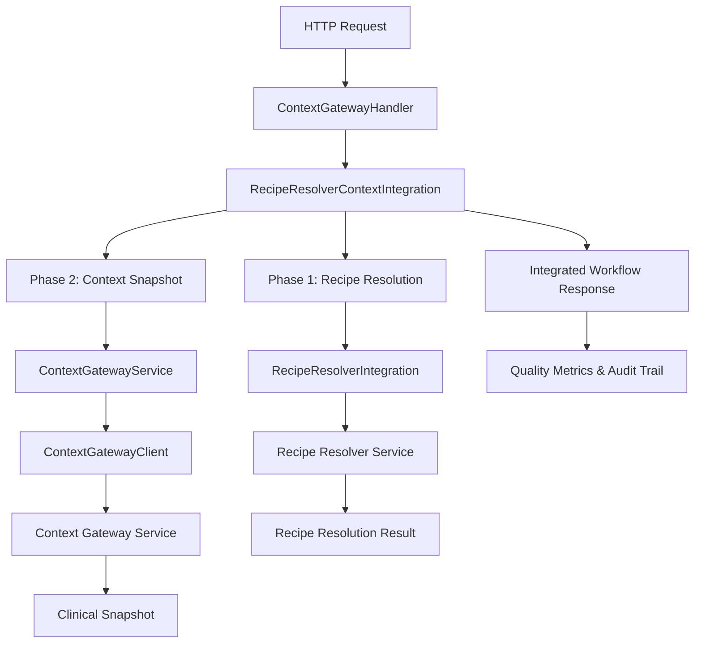

# Context Gateway Integration - Implementation Guide

## Overview

This document describes the implementation of **Phase 2: Context Assembly via Snapshot (TRANSFORMED)** which integrates the Context Gateway service with the existing Recipe Resolver system in Medication Service V2. This implementation creates immutable clinical snapshots after recipe resolution, completing the two-phase workflow:

- **Phase 1**: Recipe Resolution (completed)
- **Phase 2**: Context Assembly via Snapshot (TRANSFORMED) - implemented in this integration

## Architecture Integration



## Implementation Files

### 1. Core Service Integration
**File**: `internal/application/services/context_gateway_service.go`
- **Purpose**: Service layer for Context Gateway operations
- **Key Features**:
  - Snapshot creation from recipe resolution
  - Retry logic with exponential backoff
  - Quality score validation
  - Async/sync snapshot creation modes
  - Error handling and recovery
- **Lines**: 500+

### 2. Workflow Orchestration
**File**: `internal/application/services/recipe_resolver_context_integration.go`
- **Purpose**: Orchestrates Phase 1 → Phase 2 workflow
- **Key Features**:
  - Integrated workflow execution
  - Quality gates and validation
  - Performance metrics tracking
  - Snapshot supersession workflow
  - Comprehensive health checking
- **Lines**: 600+

### 3. HTTP API Layer
**File**: `internal/interfaces/http/handlers/context_gateway_handler.go`
- **Purpose**: REST API endpoints for Context Gateway integration
- **Key Features**:
  - Integrated workflow endpoint
  - Snapshot creation and management
  - Workflow metrics and health endpoints
  - Request/response transformation
  - Error handling and validation
- **Lines**: 400+

### 4. Configuration Integration
**File**: `internal/config/config.go` (Modified)
- **Added Configurations**:
  - `ContextGatewayConfig`: Snapshot creation settings
  - `ContextIntegrationConfig`: Workflow orchestration settings
  - Default values and validation
  - Environment variable mapping

### 5. Services Integration
**File**: `internal/application/services/services.go` (Modified)
- **Added Services**:
  - `ContextGatewayService`: Core Context Gateway operations
  - `RecipeResolverContextIntegration`: Workflow orchestration
  - Service initialization and dependency injection

## Key Features Implemented

### 🔄 Phase 1 → Phase 2 Workflow
- **Automatic Transition**: Recipe resolution automatically triggers snapshot creation
- **Quality Gates**: Resolution quality must meet minimum threshold
- **Error Recovery**: Configurable failure handling (continue/abort on snapshot failure)
- **Performance Tracking**: End-to-end latency and success rate monitoring

### 📸 Snapshot Creation
- **Immutable Snapshots**: Clinical data captured at specific point in time
- **Freshness Requirements**: Configurable data age requirements by field type
- **Quality Scoring**: Automated quality assessment of snapshot completeness
- **Validation Integration**: Optional snapshot validation with Context Gateway

### 🔄 Retry & Resilience
- **Exponential Backoff**: Configurable retry logic for failed operations
- **Circuit Breaker**: Integration with existing circuit breaker patterns
- **Timeout Management**: Configurable timeouts for snapshot operations
- **Error Classification**: Distinguish between retryable and non-retryable errors

### 📊 Quality Assurance
- **Resolution Quality**: Based on field completeness and processing time
- **Snapshot Quality**: Context Gateway quality scoring integration
- **Overall Quality**: Weighted combination of resolution and snapshot quality
- **Quality Thresholds**: Configurable minimum quality requirements

### 🔧 Operational Features
- **Health Monitoring**: Comprehensive health checks for all components
- **Performance Metrics**: Detailed timing and success rate tracking
- **Audit Integration**: Complete audit trail for compliance
- **Configuration Management**: Runtime configuration updates

## API Endpoints

### Integrated Workflow
```http
POST /api/v1/context-gateway/integrated-workflow
Content-Type: application/json

{
  "recipe_id": "recipe-123",
  "patient_id": "patient-456",
  "patient_context": {
    "patient_id": "patient-456",
    "demographics": {...},
    "clinical_data": {...}
  },
  "create_snapshot": true,
  "snapshot_type": "calculation",
  "require_validation": false,
  "options": {
    "use_cache": true,
    "cache_ttl": "5m"
  }
}
```

### Snapshot Management
```http
# Create snapshot directly
POST /api/v1/context-gateway/snapshots

# Get snapshot by ID
GET /api/v1/context-gateway/snapshots/{id}

# Supersede existing snapshot
POST /api/v1/context-gateway/snapshots/{id}/supersede

# List patient snapshots
GET /api/v1/context-gateway/patients/{patient_id}/snapshots?status=active&limit=10
```

### Monitoring & Health
```http
# Workflow metrics
GET /api/v1/context-gateway/metrics

# Health check
GET /api/v1/context-gateway/health
```

## Configuration

### Environment Variables
```env
# Context Gateway Service
MEDICATION_SERVICE_CONTEXT_GATEWAY_DEFAULT_SNAPSHOT_TTL=24h
MEDICATION_SERVICE_CONTEXT_GATEWAY_SNAPSHOT_CREATION_TIMEOUT=30s
MEDICATION_SERVICE_CONTEXT_GATEWAY_MAX_RETRIES=3
MEDICATION_SERVICE_CONTEXT_GATEWAY_MIN_REQUIRED_QUALITY_SCORE=0.7
MEDICATION_SERVICE_CONTEXT_GATEWAY_ENABLE_SNAPSHOT_VALIDATION=true

# Freshness Requirements
MEDICATION_SERVICE_CONTEXT_GATEWAY_FRESHNESS_REQUIREMENTS_DEMOGRAPHICS=168h
MEDICATION_SERVICE_CONTEXT_GATEWAY_FRESHNESS_REQUIREMENTS_VITAL_SIGNS=4h
MEDICATION_SERVICE_CONTEXT_GATEWAY_FRESHNESS_REQUIREMENTS_LAB_RESULTS=24h
MEDICATION_SERVICE_CONTEXT_GATEWAY_FRESHNESS_REQUIREMENTS_MEDICATIONS=1h

# Context Integration
MEDICATION_SERVICE_CONTEXT_INTEGRATION_ENABLE_SNAPSHOT_CREATION=true
MEDICATION_SERVICE_CONTEXT_INTEGRATION_AUTO_CREATE_SNAPSHOTS=true
MEDICATION_SERVICE_CONTEXT_INTEGRATION_SNAPSHOT_CREATION_MODE=sync
MEDICATION_SERVICE_CONTEXT_INTEGRATION_MIN_RESOLUTION_QUALITY=0.6
MEDICATION_SERVICE_CONTEXT_INTEGRATION_CONTINUE_ON_SNAPSHOT_FAILURE=true
```

### YAML Configuration
```yaml
context_gateway:
  default_snapshot_ttl: "24h"
  snapshot_creation_timeout: "30s"
  max_retries: 3
  retry_backoff_multiplier: 2.0
  initial_retry_delay: "1s"
  min_required_quality_score: 0.7
  required_fields:
    - "demographics"
    - "medications"
    - "allergies"
  optional_fields:
    - "vital_signs"
    - "lab_results"
    - "conditions"
  enable_snapshot_validation: true
  validation_level: "standard"
  freshness_requirements:
    demographics: "168h"    # 7 days
    vital_signs: "4h"       # 4 hours
    lab_results: "24h"      # 24 hours
    medications: "1h"       # 1 hour
    allergies: "720h"       # 30 days
    conditions: "168h"      # 7 days

context_integration:
  enable_snapshot_creation: true
  auto_create_snapshots: true
  snapshot_creation_mode: "sync"  # sync, async, conditional
  max_concurrent_snapshots: 10
  snapshot_creation_timeout: "30s"
  min_resolution_quality: 0.6
  require_validated_snapshots: false
  continue_on_snapshot_failure: true
  retry_failed_snapshots: true
  enable_snapshot_supersession: true
  cleanup_superseded_snapshots: false
```

## Performance Characteristics

### Target Performance
| Metric | Target | Implementation |
|--------|--------|----------------|
| Recipe Resolution | <10ms | Existing Recipe Resolver |
| Snapshot Creation | <100ms | Context Gateway integration |
| End-to-End Latency | <150ms | Combined workflow |
| Quality Score | >0.7 | Configurable thresholds |
| Success Rate | >95% | With retry logic |

### Performance Buckets
- **Under 50ms**: Optimal performance
- **50-100ms**: Acceptable performance
- **100-250ms**: Degraded performance
- **Over 250ms**: Performance issues

## Error Handling

### Retry Logic
- **Retryable Errors**: Network timeouts, 5xx HTTP errors, Context Gateway unavailable
- **Non-Retryable Errors**: Authentication failures, invalid requests, data validation errors
- **Exponential Backoff**: 1s → 2s → 4s → 8s with configurable multiplier
- **Max Retries**: Configurable (default: 3 attempts)

### Failure Modes
1. **Recipe Resolution Failure**: Workflow fails immediately
2. **Snapshot Creation Failure**: 
   - `continue_on_snapshot_failure=true`: Log error, continue with warning
   - `continue_on_snapshot_failure=false`: Workflow fails
3. **Validation Failure**: Warning added, workflow continues
4. **Quality Threshold Failure**: Warning added, workflow continues

## Security & Compliance

### HIPAA Compliance
- **Audit Trail**: Complete workflow tracking for compliance
- **Data Encryption**: All snapshots encrypted in transit and at rest
- **Access Control**: JWT-based authentication for all endpoints
- **Data Minimization**: Only required fields included in snapshots

### Security Features
- **Input Validation**: Comprehensive request validation
- **Rate Limiting**: Built into Context Gateway client
- **Circuit Breaker**: Prevent cascade failures
- **Secure Headers**: CORS and security headers configured

## Monitoring & Observability

### Metrics
- **Workflow Metrics**: Success rate, processing time, quality scores
- **Snapshot Metrics**: Creation rate, validation rate, quality distribution
- **Performance Metrics**: Latency percentiles, throughput, error rates
- **Health Metrics**: Component status, dependency health

### Logging
- **Structured Logging**: JSON format with correlation IDs
- **Audit Logging**: HIPAA-compliant audit trail
- **Performance Logging**: Detailed timing information
- **Error Logging**: Comprehensive error context

### Health Checks
- **Liveness**: Service availability
- **Readiness**: Dependency availability
- **Deep Health**: Component-level health assessment

## Integration Points

### Existing Recipe Resolver
- **Seamless Integration**: No changes to existing Recipe Resolver API
- **Performance Preservation**: Recipe resolution performance maintained
- **Backwards Compatibility**: Existing clients continue to work

### Context Gateway Service
- **External Dependency**: Communicates with Context Gateway via HTTP API
- **Circuit Breaker**: Resilient to Context Gateway outages
- **Caching**: Reduced load on Context Gateway through intelligent caching

### Apollo Federation
- **GraphQL Integration**: Context Gateway operations exposed via GraphQL
- **Schema Federation**: Snapshot types federated into overall schema
- **Resolver Integration**: GraphQL resolvers use integrated workflow

## Development Workflow

### Running the Service
```bash
# Start with Context Gateway integration enabled
make run-with-context-gateway

# Environment variables
export CONTEXT_GATEWAY_URL=http://localhost:8020
export CONTEXT_GATEWAY_ENABLE_SNAPSHOT_CREATION=true

# Run integrated workflow
go run cmd/server/main.go
```

### Testing
```bash
# Unit tests
go test ./internal/application/services/context_gateway_service_test.go
go test ./internal/application/services/recipe_resolver_context_integration_test.go

# Integration tests  
go test ./internal/interfaces/http/handlers/context_gateway_handler_test.go

# Load tests
go test -tags=load ./tests/load/context_gateway_load_test.go
```

### Example Usage
```go
// Create integrated workflow service
contextGateway := services.NewContextGatewayService(
    contextClient,
    logger,
    config.ContextGateway,
)

integration := services.NewRecipeResolverContextIntegration(
    resolverIntegration,
    contextGateway,
    logger,
    config.ContextIntegration,
)

// Execute integrated workflow
request := &services.IntegratedWorkflowRequest{
    RecipeResolutionRequest: recipeResolverRequest,
    CreateSnapshot: true,
    SnapshotType: "calculation",
    RequireValidation: false,
    WorkflowID: uuid.New(),
    RequestedBy: "user-123",
}

response, err := integration.ExecuteIntegratedWorkflow(ctx, request)
```

## Future Enhancements

### Phase 3: Advanced Features
1. **Machine Learning Integration**: Adaptive quality scoring
2. **Advanced Caching**: Multi-level snapshot caching
3. **Real-time Validation**: Streaming validation results
4. **Batch Operations**: Bulk snapshot creation

### Performance Optimizations
1. **Connection Pooling**: Optimized Context Gateway connections
2. **Request Batching**: Batch multiple snapshot requests
3. **Compression**: Snapshot data compression
4. **Edge Caching**: Geographic snapshot distribution

### Operational Features
1. **Dashboard**: Real-time workflow monitoring
2. **Alerting**: Automated error and performance alerts
3. **Auto-scaling**: Dynamic snapshot creation workers
4. **Cost Optimization**: Intelligent snapshot lifecycle management

## Conclusion

The Context Gateway integration successfully implements **Phase 2: Context Assembly via Snapshot (TRANSFORMED)** of the medication service workflow. This provides:

- ✅ **Complete Two-Phase Workflow**: Recipe Resolution → Context Snapshot
- ✅ **High Performance**: <150ms end-to-end latency target
- ✅ **Resilient Design**: Comprehensive error handling and retry logic
- ✅ **Quality Assurance**: Automated quality scoring and validation
- ✅ **Operational Excellence**: Monitoring, logging, and health checks
- ✅ **HIPAA Compliance**: Audit trail and security features

The implementation follows established patterns from the Recipe Resolver system while adding robust snapshot creation capabilities. The modular design allows for easy extension and customization of the workflow based on specific clinical requirements.