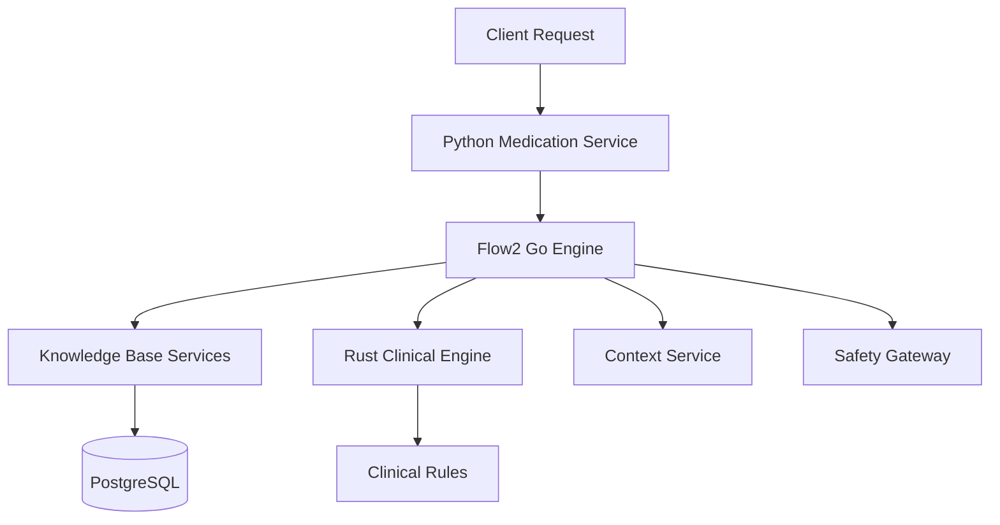

# Consolidated Medication Service Platform

This consolidated service platform provides comprehensive medication intelligence, combining Python FHIR APIs, Go orchestration engines, Rust clinical rules, and knowledge base services in a unified architecture.

## Architecture Overview

```
medication-service/
├── app/                     # Python FastAPI - FHIR medication resources
├── flow2-go-engine/         # Go - Clinical orchestration and intelligence
├── flow2-rust-engine/       # Rust - Clinical rules and safety validation
└── knowledge/               # Clinical knowledge data (YAML, TOML)

shared-infrastructure/knowledge-base-services/
├── kb-drug-rules/           # Drug calculation rules (port 8081)
├── kb-guideline-evidence/   # Clinical guidelines (port 8084)
└── api-gateway/             # Knowledge base API gateway
```

## Unified Capabilities

### Python Medication Service (Port 8004)
- FHIR-compliant medication resource management
- HL7 message processing (RDE/RAS)
- Patient-specific medication endpoints
- GraphQL Federation integration

### Flow2 Go Engine (Port 8080)
- ORB-driven clinical decision orchestration
- Multi-phase medication intelligence pipeline
- Context-aware clinical reasoning
- Enhanced proposal generation

### Rust Clinical Rules Engine (Port 8090)
- High-performance clinical rule evaluation
- Safety validation and contraindication checking
- Dose optimization and titration
- TOML-based rule definitions

### Knowledge Base Services
- **KB-Drug-Rules** (Port 8081): Drug calculation and dosing rules
- **KB-Guideline-Evidence** (Port 8084): Clinical guidelines and evidence
- **API Gateway**: Unified access to knowledge bases

## Medication Resources

The service supports the following FHIR resources:

1. **Medication**: Represents the medication itself (e.g., Ibuprofen 200mg tablet)
2. **MedicationRequest**: Represents a prescription or medication order
3. **MedicationAdministration**: Represents the administration of a medication to a patient
4. **MedicationStatement**: Represents a record of a medication being taken by a patient

## API Endpoints

### Medication Endpoints

- `POST /api/medications` - Create a new medication
- `GET /api/medications/{id}` - Get a medication by ID
- `PUT /api/medications/{id}` - Update a medication
- `DELETE /api/medications/{id}` - Delete a medication
- `GET /api/medications` - Search for medications

### MedicationRequest Endpoints

- `POST /api/medication-requests` - Create a new medication request
- `GET /api/medication-requests/{id}` - Get a medication request by ID
- `PUT /api/medication-requests/{id}` - Update a medication request
- `DELETE /api/medication-requests/{id}` - Delete a medication request
- `GET /api/medication-requests` - Search for medication requests
- `GET /api/medication-requests/patient/{patient_id}` - Get medication requests for a patient

### MedicationAdministration Endpoints

- `POST /api/medication-administrations` - Create a new medication administration
- `GET /api/medication-administrations/{id}` - Get a medication administration by ID
- `PUT /api/medication-administrations/{id}` - Update a medication administration
- `DELETE /api/medication-administrations/{id}` - Delete a medication administration
- `GET /api/medication-administrations` - Search for medication administrations
- `GET /api/medication-administrations/patient/{patient_id}` - Get medication administrations for a patient

### MedicationStatement Endpoints

- `POST /api/medication-statements` - Create a new medication statement
- `GET /api/medication-statements/{id}` - Get a medication statement by ID
- `PUT /api/medication-statements/{id}` - Update a medication statement
- `DELETE /api/medication-statements/{id}` - Delete a medication statement
- `GET /api/medication-statements` - Search for medication statements
- `GET /api/medication-statements/patient/{patient_id}` - Get medication statements for a patient

### HL7 Endpoints

- `POST /api/hl7/process` - Process any HL7 message
- `POST /api/hl7/rde` - Process HL7 RDE (Pharmacy/Treatment Encoded Order) message
- `POST /api/hl7/ras` - Process HL7 RAS (Pharmacy/Treatment Administration) message

## Quick Start

### Start All Services
```bash
# Install dependencies and start all services
make setup
make run-all
```

### Check Service Health
```bash
make health-all
```

### Individual Service Management
```bash
# Python medication service only
make run-medication

# Knowledge base services only
make run-kb

# Flow2 Go engine only
make run-flow2

# Rust engine only
make run-rust
```

### Development Workflow
```bash
make setup          # One-time setup
make run-all        # Start all services
make test-all       # Run all tests
make health-all     # Check service status
make logs-all       # Follow service logs
make stop-all       # Stop all services
```

## Service Ports & URLs

| Service | Port | URL | Purpose |
|---------|------|-----|----------|
| Python Medication Service | 8004 | http://localhost:8004 | FHIR medication resources |
| Flow2 Go Engine | 8080 | http://localhost:8080 | Clinical orchestration |
| KB-Drug-Rules | 8081 | http://localhost:8081 | Drug calculation rules |
| KB-Guideline-Evidence | 8084 | http://localhost:8084 | Clinical guidelines |
| Rust Recipe Engine | 8090 | http://localhost:8090 | Clinical rule evaluation |

## Environment Variables

### Python Medication Service
- `MONGODB_URL` - MongoDB connection URL
- `MONGODB_DB_NAME` - MongoDB database name
- `FHIR_SERVICE_URL` - FHIR service URL
- `AUTH_SERVICE_URL` - Auth service URL

### Knowledge Base Services
- `DATABASE_URL` - PostgreSQL connection for KB services
- `REDIS_URL` - Redis cache connection
- `SUPPORTED_REGIONS` - Regional compliance (US,EU,CA,AU)

### Flow2 Engine
- `RUST_ENGINE_ADDRESS` - Rust engine endpoint
- `CONTEXT_SERVICE_URL` - Context service endpoint
- `MEDICATION_API_URL` - Medication API endpoint

## Examples

### Create a Medication

```bash
curl -X POST http://localhost:8008/api/medications \
  -H "Content-Type: application/json" \
  -H "Authorization: Bearer YOUR_TOKEN" \
  -d '{
    "code": {
      "coding": [
        {
          "system": "http://www.nlm.nih.gov/research/umls/rxnorm",
          "code": "1049502",
          "display": "Acetaminophen 325 MG Oral Tablet"
        }
      ],
      "text": "Acetaminophen 325 MG Oral Tablet"
    }
  }'
```

### Create a MedicationRequest

```bash
curl -X POST http://localhost:8008/api/medication-requests \
  -H "Content-Type: application/json" \
  -H "Authorization: Bearer YOUR_TOKEN" \
  -d '{
    "status": "active",
    "intent": "order",
    "medicationCodeableConcept": {
      "coding": [
        {
          "system": "http://www.nlm.nih.gov/research/umls/rxnorm",
          "code": "1049502",
          "display": "Acetaminophen 325 MG Oral Tablet"
        }
      ],
      "text": "Acetaminophen 325 MG Oral Tablet"
    },
    "subject": {
      "reference": "Patient/123"
    },
    "authoredOn": "2023-06-15T08:00:00",
    "dosageInstruction": [
      {
        "text": "Take 1 tablet by mouth every 4-6 hours as needed for pain",
        "timing": {
          "code": {
            "text": "Every 4-6 hours as needed"
          }
        }
      }
    ]
  }'
```

### Get Medication Requests for a Patient

```bash
curl -X GET http://localhost:8008/api/medication-requests/patient/123 \
  -H "Authorization: Bearer YOUR_TOKEN"
```

### Process an HL7 RDE Message

```bash
curl -X POST http://localhost:8008/api/hl7/rde \
  -H "Content-Type: application/json" \
  -H "Authorization: Bearer YOUR_TOKEN" \
  -d '{
    "message": "MSH|^~\\&|SENDING_APPLICATION|SENDING_FACILITY|RECEIVING_APPLICATION|RECEIVING_FACILITY|20230615080000||RDE^O11|MSGID123|P|2.5.1|\rPID|||123^^^MRN||DOE^JOHN||19700101|M||\rORC|NW|ORDER123||||||20230615080000|||DOCTOR^JOHN^A|\rRXE||1049502^Acetaminophen 325 MG Oral Tablet^RXNORM|1|TAB|Q4-6H PRN|||||||\rRXR|PO||\rTQ1|||Q4-6H PRN|||20230615080000|||\r"
  }'
```

## Integration Architecture

The Consolidated Medication Service integrates with external services:

- **Apollo Federation** (`apollo-federation/`): GraphQL schema federation
- **Context Service**: Patient clinical context and observations
- **Safety Gateway Platform**: Clinical safety validation
- **FHIR Service**: FHIR resource persistence
- **Auth Service**: Authentication and authorization

## Internal Service Flow



### Request Processing Flow
1. **Python API Layer**: Receives FHIR requests and HL7 messages
2. **Flow2 Orchestrator**: Routes clinical intelligence requests
3. **Knowledge Base Query**: Fetches drug rules and guidelines
4. **Rust Engine Evaluation**: Processes clinical rules and safety
5. **Response Assembly**: Combines results into FHIR-compliant responses

## Documentation

- **Knowledge Base Services**: `../../shared-infrastructure/knowledge-base-services/` and `docs/knowledge-bases/`
- **Flow2 Architecture**: `flow2-go-engine/README.md`
- **Rust Engine Details**: `flow2-rust-engine/README.md`
- **Clinical Knowledge**: `knowledge/README.md`

For detailed architecture documentation including advanced features, security, compliance, and operational excellence, see [ARCHITECTURE.md](./ARCHITECTURE.md).
