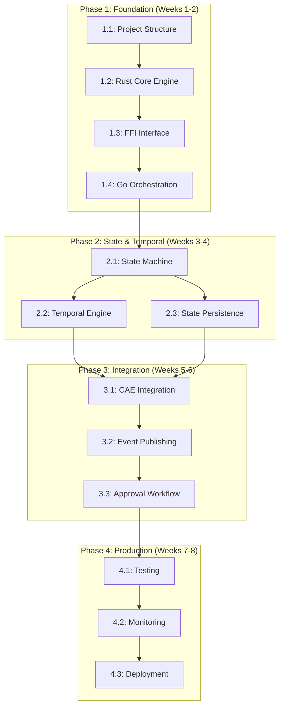

# Protocol Engine Implementation Dependency Map
## Task Dependencies and Critical Path Analysis

### Overview
This document maps the critical dependencies between implementation tasks, identifies potential blockers, and provides a visual representation of the implementation critical path for the Protocol Engine hybrid Go-Rust architecture.

---

## 🔄 Phase Dependencies Flow



---

## 📊 Critical Path Analysis

### **Primary Critical Path** (33 days total)
```
1.1 Project Structure (2 days) →
1.2 Rust Core Engine (4 days) →
1.3 FFI Interface (3 days) →
1.4 Go Orchestration (1 day) →
2.1 State Machine (4 days) →
2.2 Temporal Engine (3 days) →
3.1 CAE Integration (3 days) →
3.2 Event Publishing (4 days) →
3.3 Approval Workflow (3 days) →
4.1 Testing (4 days) →
4.2 Monitoring (2 days) →
4.3 Deployment (4 days)
```

### **Parallel Development Opportunities**
- **State Persistence (2.3)** can run parallel to **Temporal Engine (2.2)**
- **Monitoring (4.2)** can start during **Testing (4.1)**
- **Documentation** can be updated continuously throughout phases

---

## 🔐 Blocking Dependencies

### **External System Dependencies**
| Dependency | Impact | Mitigation Strategy |
|------------|---------|-------------------|
| **SnapshotManager API** | Blocks 1.2.4, 2.1.2 | Create mock service for development |
| **ContextGateway Integration** | Blocks 1.2.4, 3.1.1 | Use stub implementation initially |
| **CAE Service API** | Blocks 3.1 entirely | Coordinate with CAE team for interfaces |
| **Kafka Infrastructure** | Blocks 3.2.2, 3.2.3 | Use local Kafka for development |
| **Database Schema** | Blocks 2.3.1, 2.3.2 | Create migration scripts early |

### **Technical Dependencies**
| Dependency | Required For | Risk Level | Mitigation |
|------------|-------------|------------|------------|
| **Rust Toolchain 1.75+** | All Rust tasks | Low | Standard toolchain, well-documented |
| **CGO Configuration** | 1.3, 4.3 | Medium | Test early, document build requirements |
| **Docker Multi-stage** | 4.3.4 | Low | Standard Docker feature |
| **Kubernetes 1.28+** | 4.3.1 | Medium | Validate cluster compatibility early |

---

## ⚠️ Risk Assessment Matrix

### **High Risk Tasks** (Require immediate attention)
1. **1.3 FFI Interface Layer** 
   - Risk: Memory management complexity
   - Mitigation: Extensive testing, memory leak detection
   - Backup: Pure Go implementation fallback

2. **3.1 CAE Integration**
   - Risk: API compatibility and shared state management
   - Mitigation: Early coordination with CAE team
   - Backup: Sequential evaluation if coordination fails

3. **3.2 Event Publishing**
   - Risk: Transactional consistency with outbox pattern
   - Mitigation: Database transaction testing
   - Backup: Eventual consistency model

### **Medium Risk Tasks**
1. **2.2 Temporal Engine** - Precision timing requirements
2. **4.1 Performance Testing** - Meeting aggressive performance targets
3. **4.3 Production Deployment** - Zero-downtime deployment complexity

### **Low Risk Tasks** 
1. **1.1 Project Structure** - Standard setup procedures
2. **1.4 Go Orchestration** - Leveraging existing patterns
3. **4.2 Monitoring** - Well-established observability patterns

---

## 🔄 Task Interdependency Matrix

### **Phase 1 Dependencies**
```
Task 1.1 (Project Structure)
├── Enables: 1.2 (Rust Core Engine)
└── Blocks: All subsequent Rust development

Task 1.2 (Rust Core Engine) 
├── Depends: 1.1 completion
├── Enables: 1.3 (FFI Interface), 2.1 (State Machine)
└── Blocks: All Rust performance components

Task 1.3 (FFI Interface)
├── Depends: 1.2 completion  
├── Enables: 1.4 (Go Orchestration)
└── Blocks: Go-Rust integration

Task 1.4 (Go Orchestration)
├── Depends: 1.3 completion
├── Enables: 2.3 (State Persistence), 3.1 (CAE Integration)
└── Blocks: Service integration
```

### **Phase 2 Dependencies**
```
Task 2.1 (State Machine)
├── Depends: 1.2, 1.4 completion
├── Enables: 2.2 (Temporal Engine), 2.3 (State Persistence)  
└── Blocks: Stateful protocol implementation

Task 2.2 (Temporal Engine)
├── Depends: 2.1 completion
├── Enables: 3.1 (CAE Integration)
└── Blocks: Time-based protocol constraints

Task 2.3 (State Persistence)
├── Depends: 1.4, 2.1 completion
├── Enables: 3.1 (CAE Integration)
└── Blocks: State durability and recovery
```

### **Phase 3 Dependencies**
```
Task 3.1 (CAE Integration)
├── Depends: 2.2, 2.3 completion + CAE API availability
├── Enables: 3.2 (Event Publishing)
└── Blocks: Coordinated safety evaluation

Task 3.2 (Event Publishing)
├── Depends: 3.1 completion + Kafka infrastructure
├── Enables: 3.3 (Approval Workflow)
└── Blocks: Workflow platform integration

Task 3.3 (Approval Workflow)
├── Depends: 3.2 completion
├── Enables: 4.1 (Testing)
└── Blocks: Override and approval mechanisms
```

### **Phase 4 Dependencies**
```
Task 4.1 (Testing)
├── Depends: All Phase 3 completion
├── Enables: 4.2 (Monitoring), 4.3 (Deployment)
└── Blocks: Production readiness validation

Task 4.2 (Monitoring)
├── Depends: 4.1 substantial completion
├── Enables: 4.3 (Deployment)
└── Blocks: Production observability

Task 4.3 (Deployment)
├── Depends: 4.1, 4.2 completion
├── Enables: Production rollout
└── Blocks: Live system availability
```

---

## 🚨 Critical Bottlenecks & Mitigation

### **Bottleneck 1: FFI Memory Management (Task 1.3)**
**Impact**: Could delay entire project if memory leaks occur
**Mitigation Strategies**:
- [ ] Implement comprehensive memory leak testing from day 1
- [ ] Create memory debugging tools and automated testing
- [ ] Have pure Go fallback implementation ready
- [ ] Pair programming for all FFI-related code

### **Bottleneck 2: CAE API Coordination (Task 3.1)**
**Impact**: Could block integration testing and production deployment
**Mitigation Strategies**:
- [ ] Begin API coordination discussions immediately
- [ ] Create mock CAE service for independent development
- [ ] Design loose coupling to minimize integration dependencies
- [ ] Plan sequential evaluation fallback if needed

### **Bottleneck 3: Performance Target Achievement (Task 4.1)**  
**Impact**: Could require architecture changes if targets not met
**Mitigation Strategies**:
- [ ] Continuous performance monitoring from Phase 1
- [ ] Regular benchmark testing throughout development
- [ ] Performance optimization review at each phase
- [ ] Alternative optimization strategies prepared

### **Bottleneck 4: Database Migration (Task 2.3.1)**
**Impact**: Could delay state management and production deployment
**Mitigation Strategies**:
- [ ] Create database migration scripts in Phase 1
- [ ] Test migrations in staging environment early
- [ ] Plan backward-compatible schema changes
- [ ] Have rollback procedures documented and tested

---

## ⏱️ Time-Critical Milestones

### **Week 2 Checkpoint: Foundation Complete**
**Critical Success Factors**:
- [ ] FFI interface working with zero memory leaks
- [ ] Basic Rust-Go integration functional
- [ ] Build system reliable and documented
- [ ] Performance baseline established

**Go/No-Go Criteria**: If FFI has memory issues, pivot to pure Go implementation

### **Week 4 Checkpoint: Core Features Complete**
**Critical Success Factors**:
- [ ] State machine working for 2+ clinical protocols
- [ ] Temporal constraints accurate to millisecond precision
- [ ] Database integration functional
- [ ] Integration tests passing

**Go/No-Go Criteria**: If performance targets not met, begin optimization sprint

### **Week 6 Checkpoint: Integration Complete**
**Critical Success Factors**:
- [ ] CAE integration delivering coordinated results
- [ ] Event publishing reliable with transactional guarantees  
- [ ] Approval workflows functional
- [ ] Load testing showing target performance

**Go/No-Go Criteria**: If integration issues persist, plan sequential rollout

### **Week 8 Checkpoint: Production Ready**
**Critical Success Factors**:
- [ ] All tests passing with >95% coverage
- [ ] Security validation complete
- [ ] Monitoring and alerting functional
- [ ] Deployment automation tested

**Go/No-Go Criteria**: Production deployment authorized by safety review board

---

## 🔧 Development Environment Dependencies

### **Local Development Setup**
```bash
# Required tools and versions
Rust: 1.75+
Go: 1.21+  
Docker: 20.10+
PostgreSQL: 14+
Redis: 7.0+
Kafka: 3.5+ (development only)
```

### **CI/CD Pipeline Dependencies**
- [ ] **GitHub Actions** or equivalent with Rust/Go support
- [ ] **Docker Registry** for hybrid Go-Rust images
- [ ] **Kubernetes Cluster** for staging environment
- [ ] **Security Scanning** tools for vulnerability assessment
- [ ] **Performance Testing** infrastructure for benchmarks

### **Development Team Dependencies**
- [ ] **Rust Expertise**: At least 1 team member with advanced Rust skills
- [ ] **FFI Experience**: Knowledge of C FFI patterns and memory management
- [ ] **Clinical Domain Knowledge**: Understanding of healthcare protocols
- [ ] **DevOps Support**: Kubernetes and observability platform expertise

---

## 📋 Daily Standup Tracking

### **Phase 1 Daily Questions**
1. Are there any FFI memory management concerns?
2. Is the build system working reliably for everyone?
3. Any blockers with external service integration?
4. Performance baseline tracking on schedule?

### **Phase 2 Daily Questions**
1. State machine complexity manageable?
2. Temporal precision requirements being met?
3. Database migration testing progressing?
4. Any issues with clinical protocol implementation?

### **Phase 3 Daily Questions**
1. CAE team coordination on track?
2. Event publishing reliability concerns?  
3. Approval workflow complexity issues?
4. Integration test results meeting expectations?

### **Phase 4 Daily Questions**
1. Test coverage targets being met?
2. Performance benchmarks passing?
3. Security validation progressing?
4. Deployment readiness on schedule?

This dependency map provides clear visibility into task relationships, critical path bottlenecks, and risk mitigation strategies to ensure successful Protocol Engine implementation within the planned timeline.