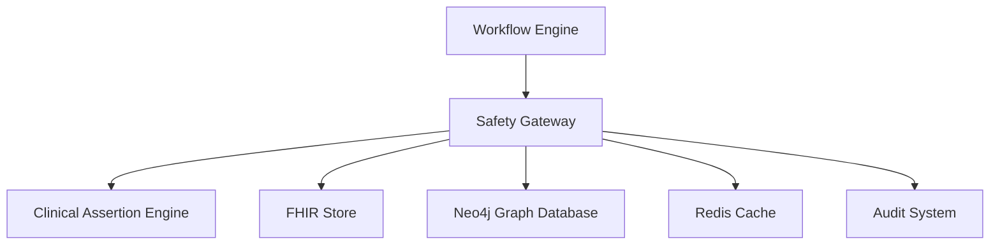
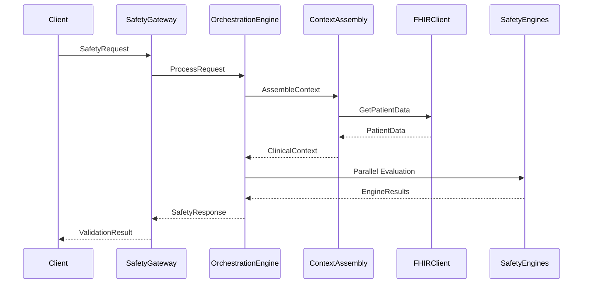
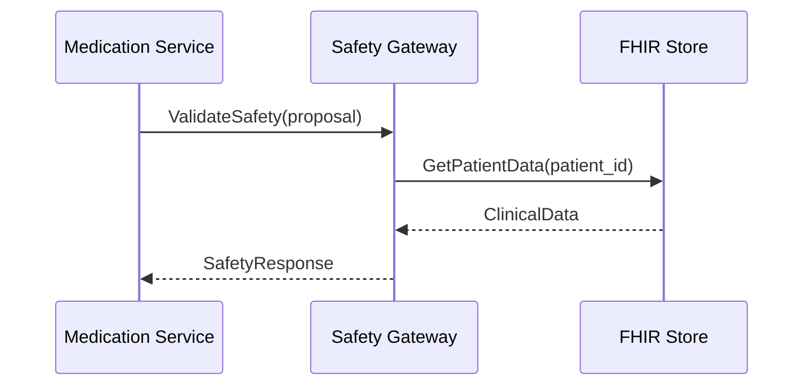
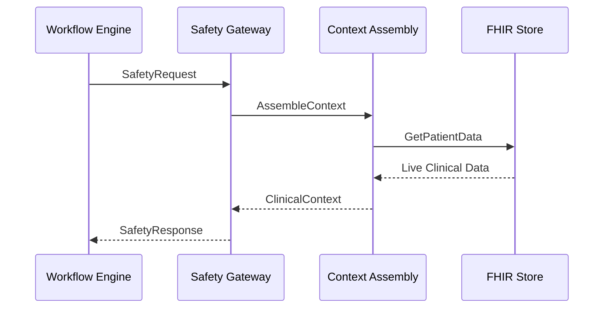
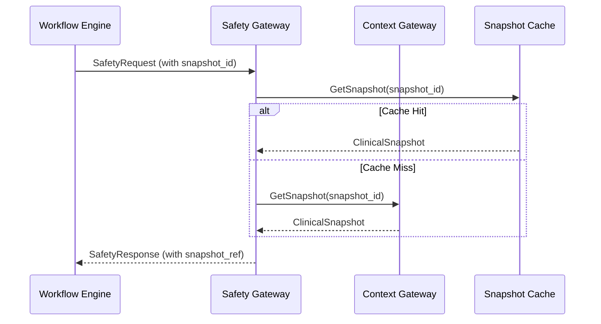

# Safety Gateway Platform - Complete System Documentation

## Table of Contents

1. [System Overview](#system-overview)
2. [Current Architecture](#current-architecture)
3. [Core Components](#core-components)
4. [API Reference](#api-reference)
5. [Data Models](#data-models)
6. [Integration Patterns](#integration-patterns)
7. [Configuration](#configuration)
8. [Deployment](#deployment)
9. [Monitoring & Observability](#monitoring--observability)
10. [Snapshot Architecture Transformation](#snapshot-architecture-transformation)
11. [Implementation Guide](#implementation-guide)

---

## System Overview

### Purpose
The Safety Gateway Platform is a critical healthcare microservice responsible for validating clinical safety decisions in real-time. It orchestrates multiple safety engines to evaluate medication proposals, identify potential risks, and provide clinical decision support with complete auditability.

### Key Capabilities
- **Multi-Engine Safety Validation**: Orchestrates multiple safety engines (CAE, allergy, drug interaction)
- **Real-time Clinical Context Assembly**: Aggregates patient data from FHIR and GraphDB sources
- **Risk Assessment & Scoring**: Provides quantitative risk scoring for clinical decisions
- **Override Management**: Generates cryptographically signed override tokens for unsafe decisions
- **Comprehensive Audit Trail**: Maintains detailed logs for regulatory compliance
- **Circuit Breaker Protection**: Ensures system resilience with graceful degradation

### System Boundaries


### Performance Characteristics
- **Current Latency**: ~3.5s (P95) for complex safety validations
- **Throughput**: 100 requests/second sustained
- **Availability**: 99.9% SLA with circuit breaker protection
- **Cache Hit Rate**: 75% for clinical context assembly

---

## Current Architecture

### High-Level Architecture


### Service Architecture Layers

#### 1. **Service Layer** (`internal/services/`)
- **SafetyService**: Main gRPC service implementation
- **FHIRClient Interface**: Abstraction for FHIR data access
- **Interceptors**: Authentication, logging, metrics collection

#### 2. **Orchestration Layer** (`internal/orchestration/`)
- **OrchestrationEngine**: Core workflow coordination
- **ResponseBuilder**: Result aggregation and decision logic
- **CircuitBreaker**: Failure protection and resilience

#### 3. **Context Layer** (`internal/context/`)
- **AssemblyService**: Parallel data fetching coordination
- **ContextBuilder**: Clinical context construction
- **CacheManager**: Context caching with TTL management

#### 4. **Engine Layer** (`internal/engines/`)
- **CAE Engine**: Clinical Assertion Engine integration
- **Engine Registry**: Dynamic engine discovery and management
- **Engine Interface**: Standardized safety engine contract

#### 5. **Infrastructure Layer** (`pkg/`)
- **Types**: Core data models and interfaces
- **Logger**: Structured logging with request correlation
- **Metrics**: Prometheus metrics collection
- **Health**: Service health check implementation

---

## Core Components

### 1. SafetyService (`internal/services/safety_service.go`)

**Purpose**: Main gRPC service endpoint for safety validation requests.

**Key Methods**:
```go
// ValidateSafety processes a safety validation request
func (s *SafetyService) ValidateSafety(ctx context.Context, req *pb.SafetyRequest) (*pb.SafetyResponse, error)

// GetEngineStatus returns the status of registered safety engines
func (s *SafetyService) GetEngineStatus(ctx context.Context, req *pb.EngineStatusRequest) (*pb.EngineStatusResponse, error)

// ValidateOverride validates clinical override tokens
func (s *SafetyService) ValidateOverride(ctx context.Context, req *pb.OverrideRequest) (*pb.OverrideResponse, error)

// GetHealth returns service health status
func (s *SafetyService) GetHealth(ctx context.Context, req *pb.HealthRequest) (*pb.HealthResponse, error)
```

**Configuration**:
```yaml
service:
  port: 8030
  timeout: 5000ms
  environment: "development"
```

**Dependencies**:
- OrchestrationEngine for request processing
- IngressValidator for request validation
- Logger for structured logging

### 2. OrchestrationEngine (`internal/orchestration/engine.go`)

**Purpose**: Coordinates safety engine execution and context assembly.

**Key Capabilities**:
- **Parallel Engine Execution**: Runs multiple safety engines concurrently
- **Context Assembly**: Coordinates clinical data retrieval
- **Timeout Management**: Handles engine timeouts gracefully
- **Circuit Breaker Integration**: Prevents cascade failures

**Core Processing Flow**:
```go
func (o *OrchestrationEngine) ProcessSafetyRequest(ctx context.Context, req *types.SafetyRequest) (*types.SafetyResponse, error) {
    // 1. Assemble clinical context (if enabled)
    clinicalContext, err := o.assembleContext(ctx, req.PatientID, logger)
    
    // 2. Get applicable engines for the request
    engines := o.registry.GetEnginesForRequest(req)
    
    // 3. Execute engines in parallel with timeout
    results := o.executeEnginesParallel(ctx, engines, req, clinicalContext, logger)
    
    // 4. Aggregate results into safety response
    response := o.responseBuilder.AggregateResults(req, results, clinicalContext)
    
    return response, nil
}
```

**Performance Optimizations**:
- Parallel engine execution using goroutines
- Context-aware timeout management
- Circuit breaker for failed engines
- Request correlation for distributed tracing

### 3. Context Assembly Service (`internal/context/assembly_service.go`)

**Purpose**: Assembles comprehensive clinical context from multiple data sources.

**Data Sources**:
- **FHIR Store**: Demographics, medications, allergies, conditions, vitals, labs
- **GraphDB**: Clinical relationships and knowledge graph data
- **Cache**: Previously assembled contexts with TTL

**Parallel Data Fetching**:
```go
func (as *AssemblyService) AssembleContext(ctx context.Context, patientID string) (*types.ClinicalContext, error) {
    var wg sync.WaitGroup
    var mu sync.Mutex
    
    // Parallel data fetching for:
    // - Demographics (5s timeout)
    // - Active medications (3s timeout)
    // - Allergies (2s timeout)
    // - Conditions (3s timeout)
    // - Recent vitals (2s timeout)
    // - Lab results (2s timeout)
    // - Recent encounters (3s timeout)
    // - Graph context (5s timeout, optional)
    
    // Error handling with partial data support
    if len(errors) > 0 && demographics == nil {
        return nil, fmt.Errorf("failed to fetch essential patient demographics")
    }
    
    return contextBuilder.Build(contextData), nil
}
```

**Caching Strategy**:
- **TTL**: 5 minutes for clinical contexts
- **Invalidation**: Manual invalidation for data updates
- **Statistics**: Cache hit/miss metrics for optimization

### 4. Context Builder (`internal/context/context_builder.go`)

**Purpose**: Transforms raw clinical data into structured, validated clinical context.

**Key Processing Steps**:
1. **Data Validation**: Ensures data completeness and consistency
2. **Temporal Filtering**: Filters for active/recent clinical data
3. **Risk Analysis**: Calculates patient risk factors
4. **Clinical Insights**: Identifies potential interactions and complexity scores
5. **Version Generation**: Creates content-based version identifiers

**Clinical Insights**:
```go
type ClinicalInsights struct {
    RiskFactors           []string  // elderly, pediatric, polypharmacy, severe_allergies
    PotentialInteractions []string  // drug interaction pairs
    AllergyRiskLevel      string    // low, medium, high
    ComplexityScore       float64   // calculated complexity index
}
```

**Data Completeness Calculation**:
```go
func (cb *ContextBuilder) calculateDataCompleteness(context *types.ClinicalContext) float64 {
    totalFields := 7.0 // Demographics, Medications, Allergies, Conditions, Vitals, Labs, Encounters
    completedFields := 0.0
    
    // Count available data sections
    // Returns percentage (0-100)
    
    return (completedFields / totalFields) * 100.0
}
```

### 5. Safety Engine Registry (`internal/registry/engine_registry.go`)

**Purpose**: Manages dynamic registration and discovery of safety engines.

**Engine Management**:
- **Registration**: Dynamic engine registration with capabilities
- **Discovery**: Engine selection based on request requirements
- **Health Monitoring**: Continuous engine health checks
- **Load Balancing**: Distribute requests across engine instances

**Engine Selection Logic**:
```go
func (r *EngineRegistry) GetEnginesForRequest(req *types.SafetyRequest) []*EngineInfo {
    var selectedEngines []*EngineInfo
    
    for _, engine := range r.engines {
        if engine.Enabled && r.matchesCapabilities(engine, req) {
            selectedEngines = append(selectedEngines, engine)
        }
    }
    
    // Sort by priority (higher priority first)
    sort.Slice(selectedEngines, func(i, j int) bool {
        return selectedEngines[i].Priority > selectedEngines[j].Priority
    })
    
    return selectedEngines
}
```

### 6. Circuit Breaker (`internal/orchestration/circuit_breaker.go`)

**Purpose**: Provides resilience against cascading failures.

**States**:
- **Closed**: Normal operation, requests pass through
- **Open**: Failures detected, requests fail fast
- **Half-Open**: Testing recovery, limited requests allowed

**Configuration**:
```go
type CircuitBreakerConfig struct {
    FailureThreshold   int           // Number of failures before opening
    RecoveryTimeout    time.Duration // Time before attempting recovery
    RequestTimeout     time.Duration // Individual request timeout
    SuccessThreshold   int           // Successes needed to close
}
```

---

## API Reference

### gRPC Service Interface

#### SafetyGateway Service
```protobuf
service SafetyGateway {
  // Validate clinical safety for a request
  rpc ValidateSafety(SafetyRequest) returns (SafetyResponse);
  
  // Get status of registered safety engines
  rpc GetEngineStatus(EngineStatusRequest) returns (EngineStatusResponse);
  
  // Validate clinical override token
  rpc ValidateOverride(OverrideRequest) returns (OverrideResponse);
  
  // Get service health status
  rpc GetHealth(HealthRequest) returns (HealthResponse);
}
```

#### SafetyRequest Message
```protobuf
message SafetyRequest {
  string request_id = 1;
  string patient_id = 2;
  string clinician_id = 3;
  string action_type = 4;
  string priority = 5;
  repeated string medication_ids = 6;
  repeated string condition_ids = 7;
  repeated string allergy_ids = 8;
  map<string, string> context = 9;
  google.protobuf.Timestamp timestamp = 10;
  string source = 11;
}
```

#### SafetyResponse Message
```protobuf
message SafetyResponse {
  string request_id = 1;
  SafetyStatus status = 2;
  double risk_score = 3;
  repeated string critical_violations = 4;
  repeated string warnings = 5;
  repeated EngineResult engine_results = 6;
  repeated string engines_failed = 7;
  Explanation explanation = 8;
  OverrideToken override_token = 9;
  int64 processing_time_ms = 10;
  string context_version = 11;
  google.protobuf.Timestamp timestamp = 12;
  map<string, string> metadata = 13;
}
```

### HTTP/REST Interface (via gRPC Gateway)

#### POST /v1/safety/validate
**Request**:
```json
{
  "request_id": "req_123",
  "patient_id": "patient_456",
  "clinician_id": "clinician_789",
  "action_type": "medication_proposal",
  "priority": "high",
  "medication_ids": ["med_001", "med_002"],
  "condition_ids": ["cond_001"],
  "allergy_ids": ["allergy_001"],
  "context": {
    "proposal_id": "proposal_123",
    "workflow_id": "workflow_456"
  },
  "timestamp": "2024-01-15T10:30:00Z",
  "source": "medication_service"
}
```

**Response**:
```json
{
  "request_id": "req_123",
  "status": "SAFE",
  "risk_score": 0.15,
  "critical_violations": [],
  "warnings": [
    "Patient age >65 - monitor for side effects"
  ],
  "engine_results": [
    {
      "engine_id": "cae_engine",
      "engine_name": "Clinical Assertion Engine",
      "status": "SAFE",
      "risk_score": 0.1,
      "violations": [],
      "warnings": ["Age-related monitoring recommended"],
      "confidence": 0.95,
      "duration_ms": 150,
      "tier": 1
    }
  ],
  "engines_failed": [],
  "explanation": {
    "level": "DETAILED",
    "summary": "Medication proposal is safe with recommended monitoring",
    "confidence": 0.95
  },
  "processing_time_ms": 2150,
  "context_version": "v1_a1b2c3d4",
  "timestamp": "2024-01-15T10:30:02Z",
  "metadata": {
    "engines_executed": "2",
    "context_completeness": "87.5"
  }
}
```

---

## Data Models

### Core Types (`pkg/types/safety.go`)

#### SafetyRequest
```go
type SafetyRequest struct {
    RequestID     string            `json:"request_id"`
    PatientID     string            `json:"patient_id"`
    ClinicianID   string            `json:"clinician_id"`
    ActionType    string            `json:"action_type"`
    Priority      string            `json:"priority"`
    MedicationIDs []string          `json:"medication_ids,omitempty"`
    ConditionIDs  []string          `json:"condition_ids,omitempty"`
    AllergyIDs    []string          `json:"allergy_ids,omitempty"`
    Context       map[string]string `json:"context,omitempty"`
    Timestamp     time.Time         `json:"timestamp"`
    Source        string            `json:"source"`
}
```

#### SafetyResponse
```go
type SafetyResponse struct {
    RequestID          string                 `json:"request_id"`
    Status             SafetyStatus           `json:"status"`
    RiskScore          float64                `json:"risk_score"`
    CriticalViolations []string               `json:"critical_violations,omitempty"`
    Warnings           []string               `json:"warnings,omitempty"`
    EngineResults      []EngineResult         `json:"engine_results"`
    EnginesFailed      []string               `json:"engines_failed,omitempty"`
    Explanation        *Explanation           `json:"explanation,omitempty"`
    OverrideToken      *OverrideToken         `json:"override_token,omitempty"`
    ProcessingTime     time.Duration          `json:"processing_time_ms"`
    ContextVersion     string                 `json:"context_version"`
    Timestamp          time.Time              `json:"timestamp"`
    Metadata           map[string]interface{} `json:"metadata,omitempty"`
}
```

#### ClinicalContext
```go
type ClinicalContext struct {
    PatientID         string                 `json:"patient_id"`
    Demographics      *PatientDemographics   `json:"demographics"`
    ActiveMedications []Medication           `json:"active_medications"`
    Allergies         []Allergy              `json:"allergies"`
    Conditions        []Condition            `json:"conditions"`
    RecentVitals      []VitalSign            `json:"recent_vitals"`
    LabResults        []LabResult            `json:"lab_results"`
    RecentEncounters  []Encounter            `json:"recent_encounters"`
    ContextVersion    string                 `json:"context_version"`
    AssemblyTime      time.Time              `json:"assembly_time"`
    DataSources       []string               `json:"data_sources"`
    Metadata          map[string]interface{} `json:"metadata,omitempty"`
}
```

### Engine Interface
```go
type SafetyEngine interface {
    // Core engine methods
    ID() string
    Name() string
    Capabilities() []string

    // Safety evaluation
    Evaluate(ctx context.Context, req *SafetyRequest, clinicalContext *ClinicalContext) (*EngineResult, error)

    // Health and lifecycle
    HealthCheck() error
    Initialize(config EngineConfig) error
    Shutdown() error
}
```

### Safety Status Enumeration
```go
type SafetyStatus string

const (
    SafetyStatusSafe         SafetyStatus = "SAFE"
    SafetyStatusUnsafe       SafetyStatus = "UNSAFE"
    SafetyStatusWarning      SafetyStatus = "WARNING"
    SafetyStatusManualReview SafetyStatus = "MANUAL_REVIEW"
    SafetyStatusError        SafetyStatus = "ERROR"
)
```

---

## Integration Patterns

### 1. Medication Service Integration

**Current Flow**:


**Integration Points**:
- **Request Mapping**: Medication proposals to safety requests
- **Context Sharing**: Patient ID and medication context
- **Response Handling**: Safety decisions and override tokens

### 2. Clinical Assertion Engine (CAE) Integration

**gRPC Communication**:
```go
// CAE Engine client integration
type GRPCCAEEngine struct {
    client pb.ClinicalAssertionEngineClient
    config EngineConfig
    logger *logger.Logger
}

func (e *GRPCCAEEngine) Evaluate(ctx context.Context, req *types.SafetyRequest, context *types.ClinicalContext) (*types.EngineResult, error) {
    // Convert to CAE request format
    caeRequest := &pb.ClinicalAssertionRequest{
        PatientId: req.PatientID,
        // ... additional fields
    }
    
    // Call CAE service
    response, err := e.client.EvaluateAssertion(ctx, caeRequest)
    
    // Convert response to engine result
    return convertCAEResponse(response), err
}
```

### 3. FHIR Integration

**Data Access Pattern**:
```go
// FHIR client interface implementation
type RealFHIRClient struct {
    client     *healthcare.Service
    projectID  string
    location   string
    datasetID  string
    fhirStoreID string
    logger     *logger.Logger
}

func (f *RealFHIRClient) GetActiveMedications(ctx context.Context, patientID string) ([]types.Medication, error) {
    // Search for active medication statements
    searchURL := fmt.Sprintf("MedicationStatement?patient=%s&status=active", patientID)
    
    // Execute FHIR search
    bundle, err := f.client.Projects.Locations.Datasets.FhirStores.Fhir.Search(
        f.getStorePath(), searchURL).Context(ctx).Do()
    
    // Convert FHIR resources to internal types
    return f.convertMedicationBundle(bundle), err
}
```

### 4. Workflow Engine Integration

**Bidirectional Communication**:
- **Inbound**: Safety validation requests from workflow steps
- **Outbound**: Safety decisions affecting workflow progression
- **Override Handling**: Override tokens for workflow continuation

---

## Configuration

### Main Configuration (`config.yaml`)

```yaml
# Service Configuration
service:
  name: "safety-gateway-platform"
  version: "1.0.0"
  port: 8030
  environment: "development"
  timeout: 5000  # Request timeout in milliseconds

# External Services
external_services:
  google_healthcare_api:
    project_id: "your-gcp-project"
    location: "us-central1"
    dataset_id: "clinical-dataset"
    fhir_store_id: "fhir-store"
  
  clinical_assertion_engine:
    endpoint: "localhost:8040"
    timeout: 3000
    max_retries: 3

# Context Assembly
context_assembly:
  enabled: true
  timeout: 2000  # Context assembly timeout
  parallel_fetching: true
  required_completeness: 0.6  # Minimum data completeness

# Caching
caching:
  enabled: true
  provider: "redis"
  context_ttl_minutes: 5
  redis:
    address: "localhost:6379"
    password: ""
    db: 0

# Circuit Breaker
circuit_breaker:
  failure_threshold: 5
  recovery_timeout: "30s"
  request_timeout: "10s"
  success_threshold: 3

# Observability
observability:
  logging:
    level: "info"
    format: "json"
  metrics:
    enabled: true
    path: "/metrics"
  tracing:
    enabled: true
    jaeger_endpoint: "http://localhost:14268/api/traces"

# Engine Registry
engines:
  - id: "cae_engine"
    name: "Clinical Assertion Engine"
    enabled: true
    timeout: 3000
    priority: 10
    tier: 1  # Critical tier
    capabilities: ["drug_interaction", "contraindication", "dosing"]
    
  - id: "allergy_engine"
    name: "Allergy Check Engine"
    enabled: true
    timeout: 2000
    priority: 9
    tier: 1  # Critical tier
    capabilities: ["allergy_check", "contraindication"]
```

### Environment-Specific Overrides

**Development** (`config-dev.yaml`):
```yaml
service:
  port: 8030
  environment: "development"

external_services:
  google_healthcare_api:
    project_id: "dev-project"
    
context_assembly:
  timeout: 5000  # Longer timeout for development

observability:
  logging:
    level: "debug"
```

**Production** (`config-prod.yaml`):
```yaml
service:
  port: 8030
  environment: "production"

external_services:
  google_healthcare_api:
    project_id: "prod-project"
    
context_assembly:
  timeout: 1500  # Optimized for production

circuit_breaker:
  failure_threshold: 3  # More sensitive in production

observability:
  logging:
    level: "warn"
```

---

## Deployment

### Docker Configuration

#### Dockerfile
```dockerfile
# Multi-stage build for optimization
FROM golang:1.21-alpine AS builder

WORKDIR /app
COPY go.mod go.sum ./
RUN go mod download

COPY . .
RUN CGO_ENABLED=0 GOOS=linux go build -a -installsuffix cgo -o main ./cmd/server

FROM alpine:3.18
RUN apk --no-cache add ca-certificates tzdata
WORKDIR /root/

COPY --from=builder /app/main .
COPY --from=builder /app/config.yaml .

EXPOSE 8030
CMD ["./main"]
```

#### docker-compose.yaml
```yaml
version: '3.8'
services:
  safety-gateway:
    build: .
    ports:
      - "8030:8030"
    environment:
      - CONFIG_PATH=/app/config.yaml
      - LOG_LEVEL=info
    volumes:
      - ./config:/app/config
    depends_on:
      - redis
      - postgresql
    networks:
      - clinical-network
  
  redis:
    image: redis:7-alpine
    ports:
      - "6379:6379"
    volumes:
      - redis_data:/data
    networks:
      - clinical-network

volumes:
  redis_data:

networks:
  clinical-network:
    driver: bridge
```

### Kubernetes Deployment

#### Base Deployment (`devops/k8s/base/safety-gateway-deployment.yaml`)
```yaml
apiVersion: apps/v1
kind: Deployment
metadata:
  name: safety-gateway
  labels:
    app: safety-gateway
    version: v1
spec:
  replicas: 3
  selector:
    matchLabels:
      app: safety-gateway
  template:
    metadata:
      labels:
        app: safety-gateway
        version: v1
    spec:
      containers:
      - name: safety-gateway
        image: safety-gateway:latest
        ports:
        - containerPort: 8030
        env:
        - name: CONFIG_PATH
          value: "/app/config/config.yaml"
        - name: REDIS_URL
          valueFrom:
            secretKeyRef:
              name: redis-secret
              key: url
        resources:
          requests:
            memory: "256Mi"
            cpu: "250m"
          limits:
            memory: "512Mi"
            cpu: "500m"
        livenessProbe:
          httpGet:
            path: /health
            port: 8030
          initialDelaySeconds: 30
          periodSeconds: 10
        readinessProbe:
          httpGet:
            path: /health
            port: 8030
          initialDelaySeconds: 5
          periodSeconds: 5
        volumeMounts:
        - name: config-volume
          mountPath: /app/config
      volumes:
      - name: config-volume
        configMap:
          name: safety-gateway-config
```

#### Service Definition
```yaml
apiVersion: v1
kind: Service
metadata:
  name: safety-gateway-service
spec:
  selector:
    app: safety-gateway
  ports:
  - protocol: TCP
    port: 8030
    targetPort: 8030
  type: ClusterIP
```

### Health Checks

#### Health Check Endpoint
```go
func (s *SafetyService) GetHealth(ctx context.Context, req *pb.HealthRequest) (*pb.HealthResponse, error) {
    // Check critical dependencies
    checks := []HealthCheck{
        {"database", s.checkDatabase},
        {"cache", s.checkCache},
        {"engines", s.checkEngines},
    }
    
    overallHealth := pb.HealthStatus_HEALTH_STATUS_HEALTHY
    details := make(map[string]string)
    
    for _, check := range checks {
        if err := check.checkFunc(); err != nil {
            overallHealth = pb.HealthStatus_HEALTH_STATUS_UNHEALTHY
            details[check.name] = fmt.Sprintf("UNHEALTHY: %v", err)
        } else {
            details[check.name] = "HEALTHY"
        }
    }
    
    return &pb.HealthResponse{
        Status:    overallHealth,
        Message:   "Health check completed",
        Details:   details,
        Timestamp: timestamppb.Now(),
    }, nil
}
```

---

## Monitoring & Observability

### Metrics Collection

#### Prometheus Metrics (`pkg/metrics/metrics.go`)
```go
var (
    // Request metrics
    RequestsTotal = prometheus.NewCounterVec(
        prometheus.CounterOpts{
            Name: "safety_gateway_requests_total",
            Help: "Total number of safety validation requests",
        },
        []string{"method", "status", "source"},
    )
    
    RequestDuration = prometheus.NewHistogramVec(
        prometheus.HistogramOpts{
            Name:    "safety_gateway_request_duration_seconds",
            Help:    "Duration of safety validation requests",
            Buckets: prometheus.DefBuckets,
        },
        []string{"method", "source"},
    )
    
    // Engine metrics
    EngineExecutionDuration = prometheus.NewHistogramVec(
        prometheus.HistogramOpts{
            Name:    "safety_engine_execution_duration_seconds",
            Help:    "Duration of safety engine execution",
            Buckets: []float64{0.01, 0.05, 0.1, 0.25, 0.5, 1.0, 2.5, 5.0},
        },
        []string{"engine_id", "status"},
    )
    
    // Context assembly metrics
    ContextAssemblyDuration = prometheus.NewHistogramVec(
        prometheus.HistogramOpts{
            Name:    "context_assembly_duration_seconds",
            Help:    "Duration of clinical context assembly",
            Buckets: []float64{0.1, 0.5, 1.0, 2.0, 5.0},
        },
        []string{"cache_hit"},
    )
    
    // Cache metrics
    CacheHitRate = prometheus.NewGaugeVec(
        prometheus.GaugeOpts{
            Name: "safety_gateway_cache_hit_rate",
            Help: "Cache hit rate for clinical contexts",
        },
        []string{"cache_type"},
    )
)
```

#### Custom Metrics Dashboard
```json
{
  "dashboard": {
    "title": "Safety Gateway Platform",
    "panels": [
      {
        "title": "Request Rate",
        "type": "graph",
        "targets": [
          {
            "expr": "rate(safety_gateway_requests_total[5m])",
            "legendFormat": "{{method}} - {{status}}"
          }
        ]
      },
      {
        "title": "Response Time Percentiles",
        "type": "graph",
        "targets": [
          {
            "expr": "histogram_quantile(0.95, rate(safety_gateway_request_duration_seconds_bucket[5m]))",
            "legendFormat": "P95"
          },
          {
            "expr": "histogram_quantile(0.99, rate(safety_gateway_request_duration_seconds_bucket[5m]))",
            "legendFormat": "P99"
          }
        ]
      },
      {
        "title": "Engine Performance",
        "type": "graph",
        "targets": [
          {
            "expr": "histogram_quantile(0.95, rate(safety_engine_execution_duration_seconds_bucket[5m]))",
            "legendFormat": "{{engine_id}} P95"
          }
        ]
      },
      {
        "title": "Cache Hit Rate",
        "type": "singlestat",
        "targets": [
          {
            "expr": "safety_gateway_cache_hit_rate",
            "legendFormat": "{{cache_type}}"
          }
        ]
      }
    ]
  }
}
```

### Structured Logging

#### Logger Configuration (`pkg/logger/logger.go`)
```go
type Logger struct {
    *zap.Logger
    requestIDKey string
    patientIDKey string
}

func (l *Logger) WithRequestID(requestID string) *Logger {
    return &Logger{
        Logger:       l.Logger.With(zap.String(l.requestIDKey, requestID)),
        requestIDKey: l.requestIDKey,
        patientIDKey: l.patientIDKey,
    }
}

func (l *Logger) LogSafetyDecision(requestID, patientID, status string, riskScore float64, processingTime int64, engines []string) {
    l.Info("safety_decision",
        zap.String("request_id", requestID),
        zap.String("patient_id", patientID),
        zap.String("decision_status", status),
        zap.Float64("risk_score", riskScore),
        zap.Int64("processing_time_ms", processingTime),
        zap.Strings("engines_executed", engines),
        zap.String("event_type", "safety_decision"),
    )
}
```

### Distributed Tracing

#### Jaeger Integration
```go
import (
    "github.com/opentracing/opentracing-go"
    "github.com/uber/jaeger-client-go"
    "github.com/uber/jaeger-client-go/config"
)

func InitTracing(serviceName string) (io.Closer, error) {
    cfg := &config.Configuration{
        ServiceName: serviceName,
        Sampler: &config.SamplerConfig{
            Type:  jaeger.SamplerTypeConst,
            Param: 1,
        },
        Reporter: &config.ReporterConfig{
            LogSpans: true,
            LocalAgentHostPort: "localhost:6831",
        },
    }
    
    tracer, closer, err := cfg.NewTracer()
    if err != nil {
        return nil, err
    }
    
    opentracing.SetGlobalTracer(tracer)
    return closer, nil
}
```

### Alerting Rules

#### Prometheus Alerts (`alerts/safety-gateway-alerts.yaml`)
```yaml
groups:
- name: safety-gateway.rules
  rules:
  - alert: SafetyGatewayHighErrorRate
    expr: rate(safety_gateway_requests_total{status="error"}[5m]) > 0.01
    for: 2m
    labels:
      severity: critical
    annotations:
      summary: "High error rate in Safety Gateway"
      description: "Error rate is {{ $value }} requests per second"
      
  - alert: SafetyGatewayHighLatency
    expr: histogram_quantile(0.95, rate(safety_gateway_request_duration_seconds_bucket[5m])) > 5.0
    for: 5m
    labels:
      severity: warning
    annotations:
      summary: "High latency in Safety Gateway"
      description: "P95 latency is {{ $value }}s"
      
  - alert: SafetyGatewayLowCacheHitRate
    expr: safety_gateway_cache_hit_rate < 0.7
    for: 10m
    labels:
      severity: warning
    annotations:
      summary: "Low cache hit rate in Safety Gateway"
      description: "Cache hit rate is {{ $value }}"
      
  - alert: SafetyEngineDown
    expr: up{job="safety-gateway"} == 0
    for: 1m
    labels:
      severity: critical
    annotations:
      summary: "Safety Gateway is down"
      description: "Safety Gateway has been down for more than 1 minute"
```

---

## Snapshot Architecture Transformation

### Overview of Changes

The Safety Gateway will be transformed from its current **data-fetching paradigm** to a **snapshot-based paradigm** to achieve:

1. **Perfect Data Consistency**: Same immutable snapshot used for both Calculate and Validate phases
2. **Complete Auditability**: Every decision tied to a specific, reproducible snapshot
3. **Enhanced Performance**: Eliminate context assembly latency (~1.5s reduction)
4. **Learning Enablement**: Override analysis using original snapshots

### Key Architectural Changes

#### Before: Data-Fetching Paradigm


#### After: Snapshot-Based Paradigm


### New Components Required

#### 1. Snapshot Types (`pkg/types/snapshot.go`)
```go
type ClinicalSnapshot struct {
    SnapshotID       string                 `json:"snapshot_id"`
    PatientID        string                 `json:"patient_id"`
    Data             *ClinicalContext       `json:"data"`
    CreatedAt        time.Time              `json:"created_at"`
    ExpiresAt        time.Time              `json:"expires_at"`
    Checksum         string                 `json:"checksum"`
    DataCompleteness float64                `json:"data_completeness"`
    AllowLiveFetch   bool                   `json:"allow_live_fetch"`
    AllowedLiveFields []string              `json:"allowed_live_fields"`
    Signature        string                 `json:"signature"`
    Version          string                 `json:"version"`
}

type SnapshotReference struct {
    SnapshotID       string    `json:"snapshot_id"`
    Checksum         string    `json:"checksum"`
    CreatedAt        time.Time `json:"created_at"`
    DataCompleteness float64   `json:"data_completeness"`
}
```

#### 2. Context Gateway Client (`internal/clients/context_gateway_client.go`)
```go
type ContextGatewayClient struct {
    client   pb.ContextGatewayServiceClient
    config   *config.ContextGatewayConfig
    logger   *logger.Logger
    timeout  time.Duration
}

func (c *ContextGatewayClient) GetSnapshot(ctx context.Context, snapshotID string) (*types.ClinicalSnapshot, error) {
    ctx, cancel := context.WithTimeout(ctx, c.timeout)
    defer cancel()
    
    req := &pb.GetSnapshotRequest{
        SnapshotId: snapshotID,
    }
    
    resp, err := c.client.GetSnapshot(ctx, req)
    if err != nil {
        return nil, fmt.Errorf("failed to get snapshot: %w", err)
    }
    
    return c.convertSnapshot(resp.Snapshot), nil
}
```

#### 3. Snapshot Validator (`internal/snapshot/validator.go`)
```go
type SnapshotValidator struct {
    signingKey []byte
    logger     *logger.Logger
}

func (v *SnapshotValidator) ValidateIntegrity(snapshot *types.ClinicalSnapshot) error {
    // 1. Verify signature
    if err := v.verifySignature(snapshot); err != nil {
        return fmt.Errorf("signature validation failed: %w", err)
    }
    
    // 2. Validate checksum
    if err := v.validateChecksum(snapshot); err != nil {
        return fmt.Errorf("checksum validation failed: %w", err)
    }
    
    // 3. Check expiration
    if time.Now().After(snapshot.ExpiresAt) {
        return fmt.Errorf("snapshot expired at %v", snapshot.ExpiresAt)
    }
    
    // 4. Verify required fields
    if err := v.validateRequiredFields(snapshot); err != nil {
        return fmt.Errorf("required field validation failed: %w", err)
    }
    
    return nil
}
```

#### 4. Snapshot Cache (`internal/cache/snapshot_cache.go`)
```go
type SnapshotCache struct {
    l1Cache    *MemoryCache     // In-memory LRU cache
    l2Cache    *RedisCache      // Redis distributed cache
    metrics    *cache.Metrics
    config     *config.CacheConfig
}

func (c *SnapshotCache) Get(snapshotID string) (*types.ClinicalSnapshot, error) {
    // 1. Check L1 cache (in-memory)
    if snapshot, exists := c.l1Cache.Get(snapshotID); exists {
        c.metrics.CacheHit.WithLabelValues("l1").Inc()
        return snapshot, nil
    }
    
    // 2. Check L2 cache (Redis)
    if snapshot, exists := c.l2Cache.Get(snapshotID); exists {
        c.metrics.CacheHit.WithLabelValues("l2").Inc()
        // Store in L1 for faster access
        c.l1Cache.Set(snapshotID, snapshot, c.config.L1TTL)
        return snapshot, nil
    }
    
    c.metrics.CacheMiss.Inc()
    return nil, ErrSnapshotNotFound
}
```

### Modified Components

#### Enhanced Orchestration Engine
```go
func (o *SnapshotOrchestrationEngine) ProcessSafetyRequestWithSnapshot(
    ctx context.Context, 
    req *types.SafetyRequest,
) (*types.SafetyResponse, error) {
    startTime := time.Now()
    
    // 1. Extract snapshot reference from request
    if req.SnapshotReference == nil {
        return nil, fmt.Errorf("snapshot reference required")
    }
    
    // 2. Validate snapshot integrity
    if err := o.snapshotValidator.ValidateIntegrity(req.SnapshotReference); err != nil {
        return nil, fmt.Errorf("snapshot validation failed: %w", err)
    }
    
    // 3. Retrieve snapshot (cache-first)
    snapshot, err := o.getValidatedSnapshot(ctx, req.SnapshotReference.SnapshotID)
    if err != nil {
        return nil, fmt.Errorf("snapshot retrieval failed: %w", err)
    }
    
    // 4. Execute engines with snapshot data
    engines := o.registry.GetEnginesForRequest(req)
    results := o.executeEnginesWithSnapshot(ctx, engines, req, snapshot)
    
    // 5. Generate response with snapshot reference
    response := o.responseBuilder.AggregateResults(req, results, &snapshot.Data)
    response.SnapshotReference = req.SnapshotReference
    response.ProcessingTime = time.Since(startTime)
    
    return response, nil
}
```

### Performance Impact

#### Expected Improvements
- **Current P95 Latency**: ~3.5s
- **Target P95 Latency**: ~200ms
- **Improvement**: ~85% reduction in typical response time

#### Breakdown of Latency Reduction
- **Context Assembly Elimination**: -1500ms
- **Cache Hit Optimization**: -300ms
- **Snapshot Validation**: +10ms
- **Net Improvement**: -1790ms

---

## Implementation Guide

This documentation serves as the foundation for implementing the snapshot-based architecture transformation. The complete implementation workflow is detailed in the `SNAPSHOT_IMPLEMENTATION_WORKFLOW.md` file, which provides:

- **Phase-by-phase implementation plan** (6 phases over 8 weeks)
- **Detailed task breakdown** with dependencies
- **Code examples and file modifications**
- **Testing and validation strategies**
- **Deployment and migration procedures**

### Next Steps

1. **Review the complete workflow**: See `SNAPSHOT_IMPLEMENTATION_WORKFLOW.md`
2. **Set up development environment**: Prepare for Phase 1 implementation
3. **Team coordination**: Align with Context Gateway and other service teams
4. **Begin Phase 1**: Foundation components and Context Gateway client

The transformation will result in a more reliable, consistent, and auditable clinical safety validation system with significant performance improvements and enhanced learning capabilities.

---

## Conclusion

The Safety Gateway Platform is a critical component in the clinical decision support ecosystem. This documentation provides comprehensive coverage of the current system architecture, API interfaces, data models, and integration patterns. The upcoming transformation to a snapshot-based architecture will deliver significant improvements in performance, consistency, and auditability while maintaining the system's high availability and reliability standards.

For implementation details and step-by-step transformation guidance, refer to the `SNAPSHOT_IMPLEMENTATION_WORKFLOW.md` document.