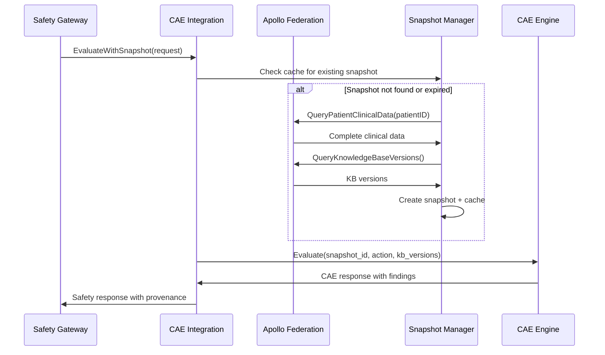
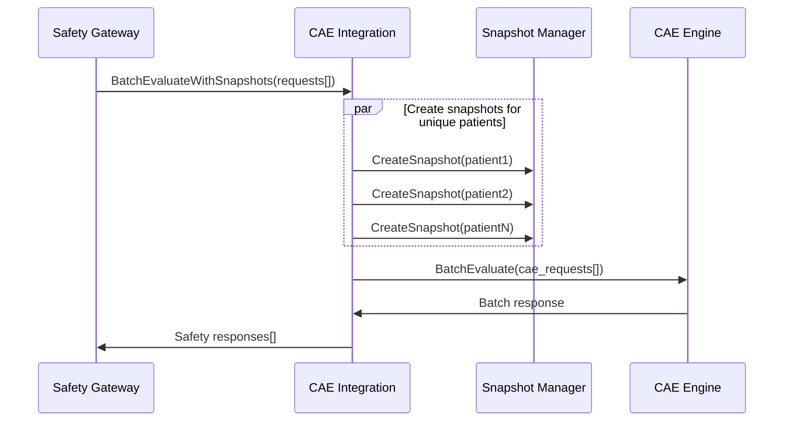
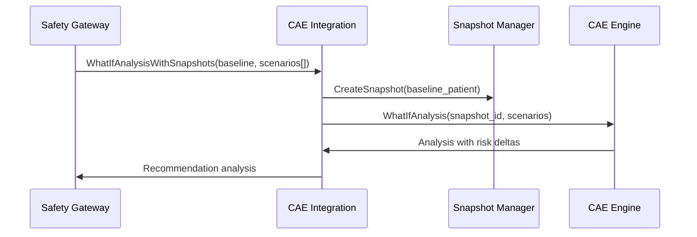

# CAE-Apollo Federation Integration

## Overview

The CAE-Apollo Integration layer bridges the Safety Gateway Platform Phase 2 with the Clinical Assertion Engine (CAE) via Apollo Federation, implementing the snapshot-based architecture described in the CAE Engine design document.

## Architecture

```
Safety Gateway Phase 2
    ↓
SafetyGatewayIntegration
    ↓
CAEApolloIntegration
    ↓
┌─────────────────┬──────────────────┬─────────────────┐
│ Apollo          │ Snapshot         │ CAE Engine      │
│ Federation      │ Manager          │ Client          │
│ Client          │                  │                 │
└─────────────────┴──────────────────┴─────────────────┘
    ↓                   ↓                   ↓
GraphQL Queries     Clinical         CAE v2.1 API
Patient Data        Snapshots        Evaluations
KB Versions         LRU Cache        What-If Analysis
```

## Key Components

### 1. CAEApolloIntegration (`cae_apollo_integration.go`)

Main orchestrator that coordinates between Apollo Federation and CAE Engine:

- **Snapshot Creation**: Queries Apollo Federation for complete patient clinical data
- **KB Version Resolution**: Retrieves current knowledge base versions
- **CAE Evaluation**: Sends snapshot-based requests to CAE Engine
- **Response Translation**: Converts CAE responses to Safety Gateway format

```go
integration, err := NewCAEApolloIntegration(
    "http://localhost:4000",  // Apollo Federation URL
    "http://localhost:8027",  // CAE Engine URL
    logger,
    WithSnapshotTTL(30*time.Minute),
    WithBatchProcessing(true, 10),
    WithKBVersionStrategy("latest"),
)
```

### 2. Apollo Federation Client (`apollo_federation_client.go`)

GraphQL client for unified clinical data access:

- **Patient Clinical Data**: Comprehensive query including demographics, medications, conditions, allergies, lab results
- **Knowledge Base Versions**: Query for current KB versions (KB1-dosing, KB3-guidelines, KB4-safety, KB5-DDI, KB7-terminology)
- **Service Tracing**: Tracks which microservices provided data for provenance

```go
response, err := apolloClient.QueryPatientClinicalData(ctx, "patient-123")
// Returns: demographics, medications, conditions, allergies, labs, vitals, procedures, encounters
```

### 3. CAE Engine Client (`cae_engine_client.go`)

HTTP client for CAE v2.1 API communication:

- **Single Evaluation**: Standard safety evaluation with snapshot
- **Batch Evaluation**: Multiple evaluations with optimized processing
- **What-If Analysis**: Scenario comparison and risk assessment
- **Engine Info**: CAE capabilities and health status

```go
caeResponse, err := caeClient.Evaluate(ctx, &CAERequest{
    RequestID:      "req-123",
    SnapshotID:     "snapshot-456",
    ProposedAction: action,
    KBVersions:     versions,
})
```

### 4. Snapshot Manager (`snapshot_manager.go`)

Clinical data snapshot lifecycle management:

- **Snapshot Creation**: Immutable clinical context with checksum validation
- **LRU Caching**: High-performance caching with configurable TTL
- **Data Quality Metrics**: Completeness scores, validation, and quality assessment
- **Provenance Tracking**: Source attribution and KB version tracking

```go
snapshot, err := snapshotManager.CreateSnapshot(ctx, "patient-123", true)
// Creates snapshot with clinical data + KB versions + quality metrics
```

## Integration Flow

### 1. Standard Evaluation



### 2. Batch Processing



### 3. What-If Analysis



## Configuration

### Environment Variables

```yaml
# Apollo Federation
APOLLO_FEDERATION_URL: "http://localhost:4000"

# CAE Engine
CAE_SERVICE_URL: "http://localhost:8027"

# Snapshot Management
SNAPSHOT_TTL: "30m"
SNAPSHOT_CACHE_SIZE: "1000"
ENABLE_CHECKSUM_VALIDATION: "true"

# Batch Processing
ENABLE_BATCH_CAE: "true"
MAX_CONCURRENT_CAE: "10"

# Knowledge Base Strategy
KB_VERSION_STRATEGY: "latest"  # "latest", "pinned", "snapshot_locked"
```

### Integration Configuration

```go
config := &IntegrationConfig{}
config.CAE.ApolloFederationURL = "http://localhost:4000"
config.CAE.CAEServiceURL = "http://localhost:8027"
config.CAE.SnapshotTTL = 30 * time.Minute
config.CAE.EnableBatchCAE = true
config.CAE.MaxConcurrentCAE = 10
config.CAE.KBVersionStrategy = "latest"
```

## Snapshot Architecture Benefits

### 1. Deterministic Evaluation
- Every CAE evaluation tied to immutable snapshot
- Reproducible results with same snapshot + KB versions
- Audit trail for clinical decision support

### 2. Performance Optimization
- LRU caching reduces Apollo Federation queries
- Batch processing with snapshot reuse
- Parallel snapshot creation for different patients

### 3. Data Consistency
- Point-in-time clinical context
- Checksum validation for data integrity
- Source attribution via Apollo Federation tracing

### 4. Knowledge Base Versioning
- Explicit KB version tracking in snapshots
- Support for pinned versions in testing
- Version change impact analysis

## Monitoring and Observability

### Health Checks

```bash
# Integration health
GET /api/v1/health/integration

# Response includes:
{
  "cae": {
    "apollo_federation": {"status": "healthy"},
    "cae_engine": {"status": "healthy"},
    "snapshot_cache": {"size": 45, "hit_rate": 0.87}
  }
}
```

### Metrics

```bash
# Integration metrics
GET /api/v1/integration/metrics

# Response includes:
{
  "cae": {
    "cache_stats": {
      "size": 45,
      "capacity": 1000,
      "hit_rate": 0.87
    },
    "configuration": {
      "snapshot_ttl": "30m0s",
      "batch_enabled": true,
      "max_concurrent": 10,
      "kb_version_strategy": "latest"
    }
  }
}
```

### Key Performance Indicators

- **Snapshot Cache Hit Rate**: Target >85%
- **Snapshot Creation Latency**: Target <500ms
- **CAE Evaluation Latency**: Target <2s for single, <10s for batch
- **Data Completeness Score**: Target >0.8 for reliable evaluations

## Testing

### Integration Tests

```bash
# Run CAE-Apollo integration tests
go test -v ./tests/integration/cae_apollo_integration_test.go

# Test scenarios:
# - Single evaluation with snapshot creation
# - Batch processing with snapshot reuse
# - What-if analysis with multiple scenarios
# - Snapshot caching and validation
# - Error handling and recovery
```

### Mock Testing

The integration includes comprehensive mock servers for:
- Apollo Federation GraphQL responses
- CAE Engine evaluation responses
- Knowledge base version data
- Patient clinical data scenarios

## Security Considerations

### Data Protection
- Snapshots contain PHI - encrypted at rest and in transit
- Configurable TTL to minimize data retention
- Checksum validation prevents tampering

### Authentication
- JWT tokens propagated to Apollo Federation
- CAE Engine authentication via headers
- Rate limiting on snapshot creation

### Audit Trail
- Every evaluation linked to specific snapshot
- KB versions recorded for compliance
- Source service attribution via Apollo tracing

## Migration from GraphDB

The integration supports gradual migration from GraphDB-based CAE:

1. **Phase 1**: Snapshot creation via Apollo Federation (current)
2. **Phase 2**: Parallel evaluation (GraphDB + Snapshot) for validation
3. **Phase 3**: Full cutover to snapshot-based evaluation
4. **Phase 4**: GraphDB decomissioning

## Troubleshooting

### Common Issues

1. **Snapshot Creation Failures**
   - Check Apollo Federation connectivity
   - Verify patient data completeness
   - Review GraphQL query syntax

2. **CAE Evaluation Errors**
   - Validate snapshot format and checksum
   - Check KB version compatibility
   - Review CAE Engine logs

3. **Performance Issues**
   - Monitor snapshot cache hit rate
   - Check for large clinical datasets
   - Review batch processing configuration

### Debug Commands

```bash
# Check snapshot details
curl -X GET "http://localhost:8030/api/v1/integration/snapshot/{snapshot_id}"

# Validate CAE connectivity
curl -X GET "http://localhost:8027/health"

# Review Apollo Federation schema
curl -X POST "http://localhost:4000/graphql" \
  -H "Content-Type: application/json" \
  -d '{"query": "{ __schema { queryType { name } } }"}'
```

## Future Enhancements

### Planned Features
1. **Snapshot Versioning**: Support for snapshot schema evolution
2. **ML Integration**: Direct ML model integration with snapshots
3. **Real-time Updates**: WebSocket-based snapshot invalidation
4. **Multi-tenant Support**: Isolated snapshots per healthcare organization
5. **Advanced Caching**: Redis cluster for distributed snapshot caching

### Performance Optimizations
1. **Snapshot Compression**: Reduce memory footprint
2. **Partial Updates**: Delta-based snapshot refreshing
3. **Predictive Caching**: ML-based cache warming
4. **Edge Computing**: Distributed snapshot creation

---

This integration represents a significant advancement in clinical decision support architecture, providing deterministic, auditable, and high-performance safety evaluations through the combination of Apollo Federation's unified data access and CAE's clinical reasoning capabilities.