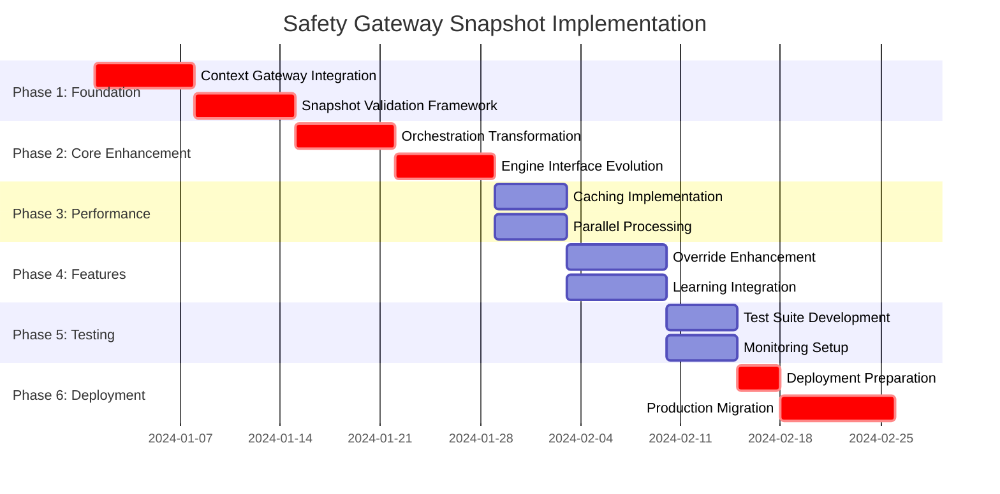

# Safety Gateway Snapshot Implementation Workflow

## Executive Summary

This comprehensive implementation workflow transforms the existing Safety Gateway Platform to support the new snapshot-based paradigm, ensuring perfect data consistency between Calculate and Validate phases while maintaining sub-200ms performance targets.

## Current Architecture Analysis

### Existing Safety Gateway Structure
- **Service**: Go-based microservice on port 8030
- **Architecture**: In-process engines with orchestration layer
- **Current Mode**: Direct context fetching from multiple sources
- **Performance**: ~200ms total latency with parallel engine execution

### Snapshot Architecture Requirements
- **Data Source**: Pre-created immutable snapshots from Context Gateway
- **Consistency**: Same snapshot used across all phases
- **Integrity**: Checksum validation and tamper detection
- **Performance**: Sub-200ms with snapshot optimization

## Phase-by-Phase Implementation Plan

### Phase 1: Foundation & Infrastructure (Weeks 1-2)
**Duration**: 2 weeks | **Risk**: Low | **Dependencies**: None

#### 1.1 Context Gateway Integration
**Files to Modify**:
- `internal/context/context_builder.go`
- `internal/services/context_assembly_service.go`
- `pkg/types/snapshot.go` (new)

**Key Changes**:
```go
// New snapshot types
type SnapshotReference struct {
    SnapshotID      string    `json:"snapshot_id"`
    Checksum        string    `json:"checksum"`
    CreatedAt       time.Time `json:"created_at"`
    ExpiresAt       time.Time `json:"expires_at"`
    Status          string    `json:"status"`
    PatientID       string    `json:"patient_id"`
    ContextVersion  string    `json:"context_version"`
}

// Enhanced SafetyRequest
type SafetyRequest struct {
    // Existing fields...
    SnapshotReference *SnapshotReference `json:"snapshot_reference,omitempty"`
    ValidationMode    string             `json:"validation_mode"` // "direct" or "snapshot"
}
```

**Tasks**:
- [ ] Create snapshot data types and interfaces
- [ ] Implement Context Gateway client integration
- [ ] Add snapshot retrieval and validation logic
- [ ] Create backward compatibility layer for direct fetching
- [ ] Add comprehensive error handling for snapshot scenarios

**Deliverables**:
- Snapshot data models and interfaces
- Context Gateway client with retry logic
- Dual-mode operation (direct + snapshot)

#### 1.2 Snapshot Validation Framework
**Files to Create**:
- `internal/snapshot/validator.go`
- `internal/snapshot/integrity_checker.go`
- `internal/snapshot/cache_manager.go`

**Key Features**:
```go
type SnapshotValidator struct {
    contextGateway ContextGatewayClient
    cacheManager   *CacheManager
    logger         *logger.Logger
}

func (v *SnapshotValidator) ValidateSnapshot(ref *SnapshotReference) error {
    // 1. Check expiration
    // 2. Verify checksum integrity
    // 3. Validate against cache
    // 4. Remote verification if needed
}
```

**Tasks**:
- [ ] Implement checksum validation
- [ ] Create snapshot expiry checking
- [ ] Build snapshot cache with TTL
- [ ] Add integrity violation detection
- [ ] Create automated recovery mechanisms

**Deliverables**:
- Complete snapshot validation framework
- Cache layer with Redis integration
- Error recovery and fallback mechanisms

### Phase 2: Core Orchestration Enhancement (Weeks 3-4)
**Duration**: 2 weeks | **Risk**: Medium | **Dependencies**: Phase 1

#### 2.1 Orchestration Engine Transformation
**Files to Modify**:
- `internal/orchestration/engine.go`
- `internal/orchestration/response_builder.go`
- `internal/services/safety_service.go`

**Key Enhancements**:
```go
func (o *OrchestrationEngine) ProcessSafetyRequestWithSnapshot(ctx context.Context, req *types.SafetyRequest) (*types.SafetyResponse, error) {
    // Step 1: Validate snapshot integrity
    if err := o.snapshotValidator.ValidateSnapshot(req.SnapshotReference); err != nil {
        return o.handleSnapshotError(err, req)
    }
    
    // Step 2: Retrieve snapshot data
    snapshot, err := o.contextGateway.GetSnapshot(req.SnapshotReference.SnapshotID)
    if err != nil {
        return o.handleSnapshotRetrievalError(err, req)
    }
    
    // Step 3: Execute engines with snapshot data
    results := o.executeEnginesWithSnapshot(ctx, engines, req, snapshot)
    
    // Step 4: Aggregate with snapshot metadata
    return o.responseBuilder.AggregateWithSnapshot(req, results, snapshot)
}
```

**Tasks**:
- [ ] Transform ProcessSafetyRequest to support snapshots
- [ ] Implement dual-mode operation (direct + snapshot)
- [ ] Add snapshot context to engine execution
- [ ] Enhance response aggregation with snapshot metadata
- [ ] Create comprehensive error handling

**Deliverables**:
- Snapshot-aware orchestration engine
- Enhanced response aggregation
- Dual-mode operation support

#### 2.2 Engine Interface Evolution
**Files to Modify**:
- `internal/registry/engine_registry.go`
- `internal/engines/cae_engine.go`
- All existing engine implementations

**Interface Changes**:
```go
type SafetyEngine interface {
    // Enhanced evaluate method
    Evaluate(ctx context.Context, req *SafetyRequest, data interface{}) (*EngineResult, error)
    
    // New snapshot-aware method
    EvaluateWithSnapshot(ctx context.Context, req *SafetyRequest, snapshot *ClinicalSnapshot) (*EngineResult, error)
    
    // Capability declarations
    SupportsSnapshotMode() bool
    GetRequiredSnapshotFields() []string
}
```

**Tasks**:
- [ ] Extend engine interface for snapshot support
- [ ] Update all existing engines for dual compatibility
- [ ] Add snapshot field requirements declaration
- [ ] Implement engine-specific snapshot optimizations
- [ ] Create engine testing framework for snapshot mode

**Deliverables**:
- Enhanced engine interface
- All engines support snapshot mode
- Backward compatibility maintained

### Phase 3: Performance Optimization (Weeks 4-5)
**Duration**: 1.5 weeks | **Risk**: Medium | **Dependencies**: Phase 2

#### 3.1 Caching Layer Implementation
**Files to Create**:
- `internal/cache/snapshot_cache.go`
- `internal/cache/context_cache.go`
- `internal/cache/redis_client.go`

**Caching Strategy**:
```go
type SnapshotCache struct {
    l1Cache *sync.Map          // In-memory, ultra-fast
    l2Cache *RedisClient       // Redis, fast
    metrics *CacheMetrics
}

func (c *SnapshotCache) GetSnapshot(snapshotID string) (*ClinicalSnapshot, error) {
    // L1 Cache (in-memory) - ~1ms
    if value, ok := c.l1Cache.Load(snapshotID); ok {
        c.metrics.L1Hits++
        return value.(*ClinicalSnapshot), nil
    }
    
    // L2 Cache (Redis) - ~5ms
    if value, err := c.l2Cache.Get(snapshotID); err == nil {
        c.l1Cache.Store(snapshotID, value)
        c.metrics.L2Hits++
        return value, nil
    }
    
    // Context Gateway fallback - ~15ms
    return c.fetchFromContextGateway(snapshotID)
}
```

**Tasks**:
- [ ] Implement multi-level caching architecture
- [ ] Add Redis integration with connection pooling
- [ ] Create cache invalidation strategies
- [ ] Add cache metrics and monitoring
- [ ] Implement cache warming for common patterns

**Deliverables**:
- Multi-level caching system
- Redis integration
- Performance monitoring

#### 3.2 Parallel Processing Enhancement
**Files to Modify**:
- `internal/orchestration/engine.go`
- `pkg/metrics/performance_tracker.go`

**Performance Optimizations**:
```go
func (o *OrchestrationEngine) executeEnginesWithSnapshotParallel(
    ctx context.Context, 
    engines []*EngineInfo, 
    snapshot *ClinicalSnapshot
) []EngineResult {
    // Optimize goroutine pool size
    maxWorkers := min(len(engines), 10)
    
    // Pre-warm data structures
    snapshotContext := o.prepareSnapshotContext(snapshot)
    
    // Execute with optimized concurrency
    return o.executeWithWorkerPool(ctx, engines, snapshotContext, maxWorkers)
}
```

**Tasks**:
- [ ] Optimize goroutine pool management
- [ ] Add snapshot data pre-processing
- [ ] Implement load balancing for engine execution
- [ ] Create performance benchmarking tools
- [ ] Add real-time performance monitoring

**Deliverables**:
- Optimized parallel processing
- Performance benchmarking suite
- Real-time monitoring

### Phase 4: Enhanced Features (Weeks 5-6)
**Duration**: 2 weeks | **Risk**: Low | **Dependencies**: Phase 3

#### 4.1 Override Token System Enhancement
**Files to Create**:
- `internal/override/snapshot_aware_token_generator.go`
- `internal/override/override_tracking.go`

**Enhanced Override Tokens**:
```go
type EnhancedOverrideToken struct {
    // Standard fields
    TokenID         string `json:"token_id"`
    DecisionSummary string `json:"decision_summary"`
    RequiredLevel   string `json:"required_override_level"`
    
    // Snapshot-aware fields
    SnapshotReference SnapshotReference `json:"snapshot_reference"`
    ReproducibilityPackage struct {
        ProposalID     string            `json:"proposal_id"`
        EngineVersions map[string]string `json:"engine_versions"`
        RuleVersions   map[string]string `json:"rule_versions"`
    } `json:"reproducibility_package"`
}
```

**Tasks**:
- [ ] Extend override tokens with snapshot references
- [ ] Add reproducibility package creation
- [ ] Implement override decision replay capability
- [ ] Create override analytics pipeline
- [ ] Add governance workflow integration

**Deliverables**:
- Enhanced override token system
- Override analytics and learning
- Governance integration

#### 4.2 Learning Gateway Integration
**Files to Create**:
- `internal/learning/override_analyzer.go`
- `internal/learning/pattern_detector.go`
- `internal/learning/recommendation_engine.go`

**Learning Pipeline**:
```go
type LearningGateway struct {
    kafkaProducer *KafkaProducer
    analyticsDB   *AnalyticsDatabase
    patternEngine *PatternRecognition
}

func (l *LearningGateway) AnalyzeOverride(overrideEvent *OverrideEvent) error {
    // Reproduce original decision using snapshot
    snapshot, _ := l.contextGateway.GetSnapshot(overrideEvent.SnapshotID)
    reproducedDecision := l.reproduceDecision(overrideEvent.OriginalProposal, snapshot)
    
    // Track patient outcomes
    outcomes := l.trackPatientOutcomes(overrideEvent.PatientID, overrideEvent.OutcomeTrackingID)
    
    // Analyze override effectiveness
    analysis := l.analyzeOverrideOutcome(reproducedDecision, overrideEvent.Justification, outcomes)
    
    // Generate learning insights
    return l.submitLearningInsight(analysis)
}
```

**Tasks**:
- [ ] Implement Kafka integration for override events
- [ ] Create pattern recognition algorithms
- [ ] Build outcome tracking system
- [ ] Add recommendation generation
- [ ] Create learning dashboard

**Deliverables**:
- Complete learning pipeline
- Pattern recognition system
- Recommendation engine

### Phase 5: Testing & Validation (Weeks 6-7)
**Duration**: 1.5 weeks | **Risk**: Low | **Dependencies**: Phase 4

#### 5.1 Comprehensive Test Suite
**Files to Create**:
- `tests/integration/snapshot_orchestration_test.go`
- `tests/performance/benchmark_test.go`
- `tests/chaos/failure_scenarios_test.go`

**Test Categories**:
```go
// Integration Tests
func TestSnapshotOrchestrationEndToEnd(t *testing.T) {
    // Test complete workflow with snapshots
    // Verify data consistency across phases
    // Validate error handling scenarios
}

// Performance Tests
func BenchmarkSnapshotVsDirectFetch(b *testing.B) {
    // Compare snapshot vs direct fetch performance
    // Measure cache hit rates
    // Validate sub-200ms targets
}

// Chaos Tests
func TestSnapshotExpiryDuringWorkflow(t *testing.T) {
    // Simulate snapshot expiry
    // Test recovery mechanisms
    // Validate data integrity
}
```

**Tasks**:
- [ ] Create comprehensive integration test suite
- [ ] Implement performance benchmarking
- [ ] Add chaos engineering tests
- [ ] Create load testing scenarios
- [ ] Add security penetration tests

**Deliverables**:
- Complete test suite
- Performance benchmarks
- Chaos testing framework

#### 5.2 Monitoring & Observability
**Files to Create**:
- `internal/monitoring/snapshot_metrics.go`
- `internal/monitoring/dashboard_generator.go`
- `monitoring/grafana-snapshot-dashboard.json`

**Monitoring Stack**:
```go
type SnapshotMetrics struct {
    SnapshotCreationLatency  prometheus.HistogramVec
    SnapshotValidationTime   prometheus.HistogramVec
    SnapshotCacheHitRate    prometheus.GaugeVec
    SnapshotConsistencyRate prometheus.GaugeVec
    SnapshotIntegrityErrors prometheus.CounterVec
}
```

**Tasks**:
- [ ] Implement comprehensive metrics collection
- [ ] Create Grafana dashboards
- [ ] Add alerting rules for snapshot issues
- [ ] Create health check endpoints
- [ ] Add distributed tracing support

**Deliverables**:
- Complete monitoring system
- Grafana dashboards
- Alerting framework

### Phase 6: Deployment & Migration (Weeks 7-8)
**Duration**: 1.5 weeks | **Risk**: High | **Dependencies**: Phase 5

#### 6.1 Deployment Strategy
**Migration Approach**: Blue-Green with Feature Flags

**Configuration**:
```yaml
# Feature flags for gradual rollout
feature_flags:
  snapshot_mode_enabled: true
  snapshot_rollout_percentage: 10  # Start with 10%
  fallback_to_direct_fetch: true
  snapshot_cache_enabled: true
  
# Performance monitoring
performance_targets:
  snapshot_retrieval_ms: 15
  snapshot_validation_ms: 5
  total_latency_ms: 200
  cache_hit_rate_target: 0.85
```

**Tasks**:
- [ ] Implement feature flag system
- [ ] Create blue-green deployment pipeline
- [ ] Add traffic splitting capabilities
- [ ] Create rollback automation
- [ ] Add deployment health checks

#### 6.2 Production Migration
**Migration Steps**:

1. **Dark Launch (Week 7.1)**
   - Deploy snapshot-aware version alongside current system
   - Route 0% traffic to snapshot mode
   - Run shadow validation comparing outputs

2. **Canary Deployment (Week 7.2)**
   - Route 10% traffic to snapshot mode
   - Monitor error rates and performance
   - Validate data consistency

3. **Gradual Rollout (Week 7.3)**
   - Increase to 50% if metrics are healthy
   - Monitor override patterns and learning
   - Validate cache performance

4. **Full Deployment (Week 8.1)**
   - Route 100% traffic to snapshot mode
   - Decommission direct fetch logic
   - Monitor full production load

**Deliverables**:
- Production deployment
- Monitoring and alerting
- Performance validation

## Task Dependencies & Critical Path

### Critical Path Analysis


### Parallel Development Opportunities

#### Week 1-2 (Foundation Phase)
**Team A**: Context Gateway integration, snapshot types
**Team B**: Snapshot validation framework, cache design
**Team C**: Documentation and test planning

#### Week 3-4 (Core Enhancement)
**Team A**: Orchestration engine transformation
**Team B**: Engine interface evolution
**Team C**: Integration test development

#### Week 4-5 (Performance)
**Team A**: Caching implementation
**Team B**: Parallel processing optimization
**Team C**: Performance test suite

#### Week 5-6 (Features)
**Team A**: Override token enhancement
**Team B**: Learning gateway integration
**Team C**: Monitoring and alerting setup

## Risk Mitigation Strategies

### High-Risk Areas

#### 1. Snapshot Consistency (CRITICAL)
**Risk**: Data inconsistency between phases
**Mitigation**:
- Implement checksum validation at every step
- Add automated consistency tests
- Create real-time monitoring alerts
- Build automatic recovery mechanisms

#### 2. Performance Degradation (HIGH)
**Risk**: Snapshot operations increase latency
**Mitigation**:
- Multi-level caching strategy
- Pre-warming of common snapshots
- Circuit breaker patterns
- Performance monitoring and alerts

#### 3. Context Gateway Dependency (HIGH)
**Risk**: Single point of failure
**Mitigation**:
- Implement fallback to direct fetch
- Add Context Gateway clustering
- Create local snapshot cache
- Build degraded mode operations

### Medium-Risk Areas

#### 4. Engine Compatibility (MEDIUM)
**Risk**: Engines don't support snapshot mode
**Mitigation**:
- Maintain dual-mode operation
- Gradual engine migration
- Backward compatibility layer
- Comprehensive testing

#### 5. Cache Invalidation (MEDIUM)
**Risk**: Stale snapshot data
**Mitigation**:
- TTL-based expiration
- Event-driven invalidation
- Cache consistency checks
- Monitoring and alerting

## Testing & Validation Gates

### Gate 1: Foundation Validation (End of Week 2)
**Criteria**:
- [ ] Context Gateway integration functional
- [ ] Snapshot validation passes all tests
- [ ] Dual-mode operation working
- [ ] Performance baseline established

**Exit Criteria**: All snapshot basic operations < 20ms

### Gate 2: Core Enhancement Validation (End of Week 4)
**Criteria**:
- [ ] Orchestration engine supports snapshots
- [ ] All engines compatible with snapshot mode
- [ ] End-to-end workflow functional
- [ ] Error handling comprehensive

**Exit Criteria**: Complete workflow < 200ms with snapshots

### Gate 3: Performance Validation (End of Week 5)
**Criteria**:
- [ ] Caching system operational
- [ ] Performance targets met
- [ ] Load testing passed
- [ ] Resource usage acceptable

**Exit Criteria**: 80%+ cache hit rate, sub-200ms latency

### Gate 4: Feature Validation (End of Week 6)
**Criteria**:
- [ ] Override system enhanced
- [ ] Learning pipeline functional
- [ ] Monitoring and alerting operational
- [ ] Security testing passed

**Exit Criteria**: All features functional with comprehensive monitoring

### Gate 5: Production Readiness (End of Week 7)
**Criteria**:
- [ ] All tests passing
- [ ] Performance benchmarks met
- [ ] Security audit completed
- [ ] Documentation complete
- [ ] Rollback procedures tested

**Exit Criteria**: Ready for production deployment

## Rollback & Contingency Plans

### Rollback Triggers
- Error rate increase > 5%
- Latency increase > 20%
- Snapshot consistency failures
- Critical security issues
- Performance degradation

### Automated Rollback Procedures

#### Level 1: Traffic Diversion (< 5 minutes)
```bash
# Immediate traffic diversion to direct fetch mode
kubectl patch configmap safety-gateway-config --type merge -p '{"data":{"snapshot_mode_enabled":"false"}}'
```

#### Level 2: Service Rollback (< 10 minutes)
```bash
# Rollback to previous service version
kubectl rollout undo deployment/safety-gateway-platform
```

#### Level 3: Infrastructure Rollback (< 30 minutes)
```bash
# Complete infrastructure rollback
helm rollback safety-gateway-platform 1
```

### Manual Recovery Procedures

#### Data Consistency Issues
1. Stop snapshot-aware processing
2. Validate data integrity
3. Repair inconsistent records
4. Restart with verified snapshots

#### Performance Issues
1. Enable performance debugging
2. Identify bottlenecks
3. Increase cache sizes
4. Optimize slow operations

## Resource Allocation & Time Estimates

### Team Structure
**Team A** (Backend/Go): 2 Senior + 1 Mid-level developers
**Team B** (Integration/Testing): 2 Senior developers
**Team C** (DevOps/Monitoring): 1 Senior + 1 Mid-level engineer

### Time Estimates by Phase

| Phase | Duration | Effort (Person-Days) | Team Distribution |
|-------|----------|---------------------|-------------------|
| Phase 1: Foundation | 2 weeks | 30 days | Team A: 20, Team B: 5, Team C: 5 |
| Phase 2: Core Enhancement | 2 weeks | 35 days | Team A: 25, Team B: 10 |
| Phase 3: Performance | 1.5 weeks | 25 days | Team A: 15, Team B: 5, Team C: 5 |
| Phase 4: Features | 2 weeks | 30 days | Team A: 20, Team B: 10 |
| Phase 5: Testing | 1.5 weeks | 20 days | Team B: 15, Team C: 5 |
| Phase 6: Deployment | 1.5 weeks | 15 days | Team A: 5, Team C: 10 |
| **Total** | **8 weeks** | **155 days** | **6 team members** |

### Budget Estimation
- Development: 155 person-days × $800/day = $124,000
- Infrastructure: $5,000 (Redis, monitoring)
- Testing tools: $3,000
- **Total Project Cost**: ~$132,000

## Cross-Service Integration Coordination

### Workflow Engine Service Integration
**Timeline**: Parallel to Phase 1-2
**Coordination Points**:
- Snapshot reference sharing
- Error handling alignment
- Performance target coordination
- Testing integration

### Context Gateway Enhancement
**Timeline**: Prerequisite for Phase 1
**Requirements**:
- Snapshot creation API
- Snapshot retrieval optimization
- Cache integration
- Monitoring alignment

### Medication Service Updates
**Timeline**: Parallel to Phase 4
**Updates Needed**:
- Enhanced commit endpoints
- Audit trail integration
- Override handling enhancement
- Event publishing updates

## Success Criteria & Metrics

### Performance Metrics
- **Snapshot Retrieval**: < 15ms (target: 10ms)
- **Snapshot Validation**: < 5ms (target: 3ms)
- **Total Latency**: < 200ms (target: 180ms)
- **Cache Hit Rate**: > 85% (target: 90%)

### Reliability Metrics
- **Consistency Rate**: > 99.9%
- **Error Rate**: < 0.1%
- **Availability**: > 99.9%
- **Recovery Time**: < 30 seconds

### Business Metrics
- **Override Learning**: 100% capture rate
- **Audit Compliance**: 100% trail completeness
- **Performance Improvement**: 15-20% latency reduction
- **Data Consistency**: Zero consistency errors

## Conclusion

This comprehensive implementation workflow provides a structured approach to transforming the Safety Gateway Platform for snapshot-based operations. The phased approach minimizes risk while ensuring thorough testing and validation at each stage.

**Key Success Factors**:
1. **Incremental Implementation**: Each phase builds on previous work
2. **Parallel Development**: Teams can work on different components simultaneously
3. **Comprehensive Testing**: Multiple validation gates ensure quality
4. **Risk Mitigation**: Detailed contingency plans for all scenarios
5. **Performance Focus**: Continuous monitoring of latency targets

The implementation maintains backward compatibility throughout the transition, enabling safe production deployment with minimal risk to existing clinical workflows.