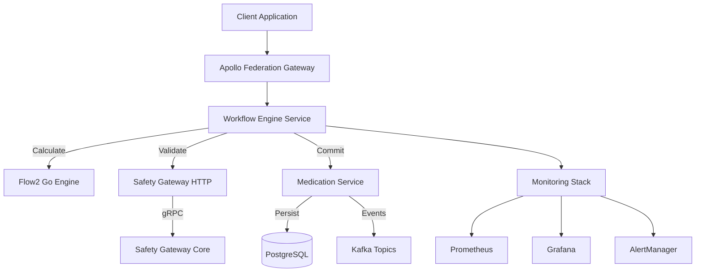

# Calculate > Validate > Commit Workflow API Documentation

## Table of Contents
- [Overview](#overview)
- [Architecture](#architecture)
- [API Reference](#api-reference)
- [Data Models](#data-models)
- [Integration Guide](#integration-guide)
- [Monitoring & Operations](#monitoring--operations)
- [Error Handling](#error-handling)
- [Examples](#examples)

---

## Overview

The Calculate > Validate > Commit workflow provides a comprehensive medication request orchestration system that ensures clinical safety, regulatory compliance, and operational excellence. The workflow implements a three-phase approach:

1. **Calculate Phase**: Generates medication proposals using clinical intelligence engines
2. **Validate Phase**: Performs comprehensive safety validation via Safety Gateway
3. **Commit Phase**: Persists approved proposals and publishes events

### Key Features
- **Performance Targets**: 175ms Calculate, 100ms Validate, 50ms Commit
- **Safety-First Design**: Multiple validation engines with override capabilities
- **Audit Compliance**: Full audit trails for regulatory requirements
- **Event-Driven Architecture**: Kafka integration for downstream processing
- **Production Monitoring**: Comprehensive observability and alerting

### Service Endpoints
| Service | Base URL | Purpose |
|---------|----------|---------|
| Workflow Engine | `http://localhost:8050` | Workflow orchestration |
| Safety Gateway | `http://localhost:8080` | Clinical safety validation |
| Medication Service | `http://localhost:8004` | Medication proposal management |

---

## Architecture



### Component Responsibilities

#### Workflow Engine Service
- **Orchestration**: Coordinates the three-phase workflow execution
- **Performance Monitoring**: Tracks phase timing and success rates
- **Error Handling**: Manages failures and retry logic
- **Health Monitoring**: Provides comprehensive health checks

#### Safety Gateway HTTP
- **Validation Orchestration**: Routes requests to appropriate validation engines
- **Risk Assessment**: Evaluates clinical safety and generates risk scores
- **Override Management**: Handles provider override scenarios
- **Performance Optimization**: Caches validation results for efficiency

#### Medication Service Enhanced Commit
- **Proposal Persistence**: Stores validated proposals in database
- **Audit Trail Creation**: Generates compliance audit records
- **Event Publishing**: Publishes workflow events to Kafka
- **Validation Verification**: Ensures validation integrity before commit

---

## API Reference

### 1. Workflow Orchestration API

#### Execute Complete Workflow
```http
POST /api/v1/orchestrate/medication-request
Content-Type: application/json
Authorization: Bearer {jwt_token}

{
  "correlation_id": "corr_abc123def456",
  "patient_id": "patient_789",
  "medication_request": {
    "medication_code": "313782",
    "medication_name": "Lisinopril 10mg",
    "dosage": "10mg",
    "frequency": "once daily",
    "route": "oral",
    "indication": "Hypertension"
  },
  "clinical_intent": {
    "primary_indication": "Essential hypertension",
    "target_outcome": "BP control <140/90",
    "urgency": "routine"
  },
  "provider_context": {
    "provider_id": "provider_456",
    "specialty": "internal_medicine",
    "organization_id": "org_123"
  }
}
```

**Success Response (200)**:
```json
{
  "status": "SUCCESS",
  "correlation_id": "corr_abc123def456",
  "medication_order_id": "order_789abc123",
  "calculation": {
    "proposal_set_id": "props_456def789",
    "snapshot_id": "snap_123456789",
    "execution_time_ms": 142,
    "proposal_count": 3
  },
  "validation": {
    "validation_id": "val_987654321",
    "verdict": "SAFE",
    "risk_score": 0.15,
    "processing_time_ms": 87
  },
  "commitment": {
    "order_id": "order_789abc123",
    "audit_trail_id": "audit_555666777",
    "persistence_status": "COMMITTED",
    "event_status": "PUBLISHED"
  },
  "performance": {
    "total_time_ms": 298,
    "meets_target": true,
    "calculate_time_ms": 142,
    "validate_time_ms": 87,
    "commit_time_ms": 69
  }
}
```

**Warning Response (200)**:
```json
{
  "status": "REQUIRES_PROVIDER_DECISION",
  "correlation_id": "corr_abc123def456",
  "validation_findings": [
    {
      "finding_id": "find_001",
      "severity": "MEDIUM",
      "category": "DRUG_INTERACTION",
      "description": "Potential interaction with current ACE inhibitor",
      "clinical_significance": "Monitor for hypotension",
      "recommendation": "Start with lower dose or consider alternative"
    }
  ],
  "override_tokens": ["override_token_abc123"],
  "proposals": [
    {
      "proposal_id": "prop_001",
      "medication_name": "Lisinopril 5mg",
      "dosage": "5mg",
      "confidence_score": 0.87
    }
  ],
  "snapshot_id": "snap_123456789"
}
```

#### Individual Phase Operations

##### Calculate Phase
```http
POST /api/v1/calculate
Content-Type: application/json

{
  "patient_id": "patient_789",
  "medication_request": { ... },
  "clinical_intent": { ... },
  "provider_context": { ... },
  "correlation_id": "corr_abc123def456",
  "execution_mode": "snapshot_optimized"
}
```

##### Validate Phase  
```http
POST /api/v1/validate
Content-Type: application/json

{
  "proposal_set_id": "props_456def789",
  "snapshot_id": "snap_123456789",
  "selected_proposals": [ ... ],
  "validation_requirements": {
    "cae_engine": true,
    "protocol_engine": true,
    "comprehensive_validation": true
  },
  "correlation_id": "corr_abc123def456"
}
```

##### Commit Phase
```http
POST /api/v1/commit
Content-Type: application/json

{
  "proposal_set_id": "props_456def789",
  "validation_id": "val_987654321",
  "selected_proposal": { ... },
  "provider_decision": {
    "auto_selected": false,
    "override_reason": null,
    "additional_instructions": "Monitor BP weekly"
  },
  "correlation_id": "corr_abc123def456"
}
```

### 2. Safety Gateway HTTP API

#### Comprehensive Validation
```http
POST http://localhost:8080/api/v1/validate/comprehensive
Content-Type: application/json

{
  "proposal_set_id": "props_456def789",
  "snapshot_id": "snap_123456789",
  "proposals": [
    {
      "proposal_id": "prop_001",
      "medication_code": "313782",
      "medication_name": "Lisinopril 10mg",
      "dosage": "10mg",
      "frequency": "once daily",
      "route": "oral",
      "clinical_evidence": { ... }
    }
  ],
  "patient_context": {
    "patient_id": "patient_789",
    "age": 45,
    "weight_kg": 75,
    "allergies": [],
    "current_medications": [ ... ],
    "medical_conditions": ["hypertension"]
  },
  "validation_requirements": {
    "cae_engine": true,
    "protocol_engine": true,
    "comprehensive_validation": true,
    "allergy_check": true,
    "drug_interaction_check": true
  },
  "correlation_id": "corr_abc123def456"
}
```

**Response**:
```json
{
  "validation_id": "val_987654321",
  "verdict": "SAFE",
  "risk_score": 0.15,
  "findings": [],
  "override_tokens": [],
  "engine_results": [
    {
      "engine_id": "cae_engine",
      "engine_name": "Clinical Appropriateness Engine",
      "status": "SUCCESS",
      "risk_score": 0.12,
      "confidence": 0.95,
      "duration_ms": 45
    }
  ],
  "processing_time_ms": 87,
  "result": "SUCCESS"
}
```

### 3. Enhanced Medication Service API

#### Enhanced Commit with Validation Verification
```http
POST http://localhost:8004/api/v1/medication/commit
Content-Type: application/json
Authorization: Bearer {jwt_token}

{
  "proposal_set_id": "props_456def789",
  "validation_id": "val_987654321",
  "selected_proposal": {
    "proposal_id": "prop_001",
    "medication_code": "313782",
    "medication_name": "Lisinopril 10mg",
    "dosage": "10mg",
    "frequency": "once daily",
    "route": "oral",
    "confidence_score": 0.87
  },
  "provider_decision": {
    "auto_selected": false,
    "additional_instructions": "Monitor BP weekly",
    "follow_up_required": true,
    "follow_up_interval": "2 weeks"
  },
  "correlation_id": "corr_abc123def456"
}
```

### 4. Monitoring & Health API

#### Comprehensive Health Check
```http
GET /monitoring/health
```

**Response**:
```json
{
  "status": "healthy",
  "timestamp": "2025-01-09T10:30:00Z",
  "check_duration_ms": 245,
  "services": {
    "workflow_engine": {
      "status": "healthy",
      "response_time_ms": 12,
      "metadata": {
        "error_rate_percent": 0.2,
        "avg_processing_time_ms": 298,
        "total_requests": 1247
      }
    },
    "safety_gateway": {
      "status": "healthy", 
      "response_time_ms": 45,
      "version": "1.2.0"
    }
  },
  "summary": {
    "total_services": 5,
    "healthy_services": 5,
    "health_percentage": 100
  }
}
```

#### Prometheus Metrics
```http
GET /monitoring/metrics
```

Key metrics exposed:
- `workflow_requests_total{status="success|warning|error"}`
- `workflow_phase_duration_seconds{phase="calculate|validate|commit"}`
- `safety_gateway_validations_total{verdict="safe|warning|unsafe"}`
- `proposal_operations_total{operation="create|update|commit"}`

---

## Data Models

### Core Workflow Types

#### MedicationOrchestrationInput
```typescript
interface MedicationOrchestrationInput {
  patientId: string;
  medicationRequest: MedicationRequestInput;
  clinicalIntent: ClinicalIntentInput;
  providerContext: ProviderContextInput;
  correlationId?: string;
  urgency?: WorkflowUrgency;
  preferences?: WorkflowPreferences;
}
```

#### WorkflowProposal (Database Model)
```python
class WorkflowProposal(Base):
    __tablename__ = "workflow_proposals"
    
    id: int = Column(Integer, primary_key=True)
    proposal_id: str = Column(String(50), unique=True, nullable=False)
    proposal_type: str = Column(String(50), nullable=False)
    status: str = Column(String(20), nullable=False)
    workflow_phase: str = Column(String(20))
    correlation_id: str = Column(String(100), nullable=False)
    
    # Clinical data
    patient_id: str = Column(String(100), nullable=False)
    provider_id: str = Column(String(100), nullable=False)
    medication_data: dict = Column(JSON)
    clinical_context: dict = Column(JSON)
    
    # Workflow tracking
    snapshot_id: str = Column(String(100), nullable=True)
    validation_id: str = Column(String(100), nullable=True)
    validation_verdict: str = Column(String(20), nullable=True)
    medication_order_id: str = Column(String(100), nullable=True)
    
    # Timestamps
    created_at: datetime = Column(DateTime(timezone=True), default=func.now())
    updated_at: datetime = Column(DateTime(timezone=True), onupdate=func.now())
    expires_at: datetime = Column(DateTime(timezone=True), nullable=True)
```

### Validation Models

#### SafetyValidationRequest
```python
@dataclass
class SafetyValidationRequest:
    proposal_set_id: str
    snapshot_id: str
    proposals: List[Dict[str, Any]]
    patient_context: Dict[str, Any]
    validation_requirements: Dict[str, Any]
    correlation_id: str
    timeout_ms: int = 10000
```

#### SafetyValidationResponse
```python
@dataclass
class SafetyValidationResponse:
    validation_id: str
    verdict: str  # SAFE, WARNING, UNSAFE, ERROR
    risk_score: float
    findings: List[ValidationFinding]
    override_tokens: List[str]
    engine_results: List[EngineResult]
    processing_time_ms: float
```

---

## Integration Guide

### GraphQL Federation Integration

The workflow exposes a GraphQL schema through Apollo Federation for client applications:

```graphql
# Execute complete workflow
mutation OrchestrateMedicationRequest($input: MedicationOrchestrationInput!) {
  orchestrateMedicationRequest(input: $input) {
    status
    correlationId
    medicationOrderId
    calculation {
      proposalSetId
      executionTimeMs
    }
    validation {
      verdict
      riskScore
    }
    performance {
      totalTimeMs
      meetsTarget
    }
  }
}
```

### Event-Driven Integration

The workflow publishes events to Kafka topics for downstream processing:

#### Workflow Events Topic: `workflow-events`
```json
{
  "event_type": "workflow_completed",
  "correlation_id": "corr_abc123def456",
  "patient_id": "patient_789",
  "medication_order_id": "order_789abc123",
  "status": "SUCCESS",
  "performance": {
    "total_time_ms": 298,
    "meets_target": true
  },
  "timestamp": "2025-01-09T10:30:00Z"
}
```

#### Validation Events Topic: `validation-events`  
```json
{
  "event_type": "validation_completed",
  "validation_id": "val_987654321",
  "verdict": "SAFE",
  "risk_score": 0.15,
  "findings_count": 0,
  "processing_time_ms": 87,
  "timestamp": "2025-01-09T10:30:00Z"
}
```

### Database Integration Patterns

#### Proposal Repository Usage
```python
from app.repositories.workflow_proposal_repository import get_workflow_proposal_repository

# Initialize repository
repo = get_workflow_proposal_repository()

# Create proposal
proposal = await repo.create_proposal(
    request=ProposalCreateRequest(...),
    created_by="system",
    correlation_id="corr_abc123def456"
)

# Search proposals
proposals, total = await repo.search_proposals(
    patient_id="patient_789",
    status="COMMITTED",
    limit=50
)

# Get statistics
stats = await repo.get_proposal_statistics()
```

---

## Monitoring & Operations

### Key Performance Indicators

#### Phase Performance Targets
- **Calculate Phase**: ≤ 175ms (95th percentile)
- **Validate Phase**: ≤ 100ms (95th percentile)  
- **Commit Phase**: ≤ 50ms (95th percentile)
- **Total Workflow**: ≤ 325ms (95th percentile)

#### Success Rate Targets
- **Overall Success Rate**: ≥ 95%
- **Validation Safe Rate**: ≥ 80%
- **Performance Target Adherence**: ≥ 90%

### Monitoring Integration

#### Prometheus Query Examples
```promql
# Workflow success rate over last 5 minutes
(
  rate(workflow_requests_total{status="success"}[5m]) / 
  rate(workflow_requests_total[5m])
) * 100

# 95th percentile phase duration
histogram_quantile(0.95, 
  rate(workflow_phase_duration_seconds_bucket[5m])
)

# Performance target adherence
avg(workflow_performance_target_adherence_ratio) * 100
```

#### Grafana Dashboard Queries
```json
{
  "title": "Workflow Performance Overview",
  "panels": [
    {
      "title": "Success Rate",
      "query": "rate(workflow_requests_total{status=\"success\"}[5m]) / rate(workflow_requests_total[5m])",
      "visualization": "stat"
    },
    {
      "title": "Phase Duration",  
      "query": "histogram_quantile(0.95, rate(workflow_phase_duration_seconds_bucket[5m]))",
      "visualization": "graph"
    }
  ]
}
```

### Health Check Integration

#### Kubernetes Probes
```yaml
apiVersion: v1
kind: Pod
spec:
  containers:
  - name: workflow-engine
    livenessProbe:
      httpGet:
        path: /monitoring/health/live
        port: 8050
      initialDelaySeconds: 30
      periodSeconds: 10
    readinessProbe:
      httpGet:
        path: /monitoring/health/ready
        port: 8050
      initialDelaySeconds: 5
      periodSeconds: 5
```

---

## Error Handling

### Error Response Format

All API endpoints return errors in a consistent format:

```json
{
  "error": {
    "code": "VALIDATION_FAILED",
    "message": "Validation failed due to drug interaction",
    "details": {
      "correlation_id": "corr_abc123def456",
      "validation_id": "val_987654321",
      "findings": [
        {
          "severity": "HIGH",
          "category": "DRUG_INTERACTION",
          "description": "ACE inhibitor interaction detected"
        }
      ]
    },
    "timestamp": "2025-01-09T10:30:00Z"
  }
}
```

### Error Codes

#### Workflow Engine Errors
| Code | Description | HTTP Status | Recovery Action |
|------|-------------|-------------|----------------|
| `CALCULATE_TIMEOUT` | Calculate phase exceeded timeout | 408 | Retry with extended timeout |
| `VALIDATE_FAILED` | Validation service unavailable | 502 | Check Safety Gateway health |
| `COMMIT_FAILED` | Commit operation failed | 500 | Check database connectivity |
| `INVALID_PROPOSAL` | Proposal data validation failed | 400 | Correct proposal format |

#### Safety Gateway Errors  
| Code | Description | HTTP Status | Recovery Action |
|------|-------------|-------------|----------------|
| `VALIDATION_ENGINE_ERROR` | Validation engine failure | 500 | Check engine health |
| `UNSAFE_MEDICATION` | Medication deemed unsafe | 422 | Require provider override |
| `INSUFFICIENT_DATA` | Missing validation data | 400 | Provide complete patient context |

### Retry Strategies

#### Calculate Phase Retries
```python
@retry(
    stop=stop_after_attempt(3),
    wait=wait_exponential(multiplier=1, min=4, max=10),
    retry=retry_if_exception_type(CalculateTimeoutError)
)
async def execute_calculate_phase(...):
    # Calculate logic
```

#### Validation Retries
```python  
@retry(
    stop=stop_after_attempt(2),
    wait=wait_fixed(2),
    retry=retry_if_exception_type(ValidationServiceUnavailableError)
)
async def execute_validate_phase(...):
    # Validation logic
```

---

## Examples

### Complete Workflow Integration

```python
import httpx
import asyncio
from datetime import datetime

async def execute_medication_workflow():
    """Complete workflow execution example"""
    
    # Prepare request
    request_data = {
        "correlation_id": f"corr_{datetime.now().strftime('%Y%m%d_%H%M%S')}",
        "patient_id": "patient_12345",
        "medication_request": {
            "medication_code": "313782",
            "medication_name": "Lisinopril 10mg",
            "dosage": "10mg",
            "frequency": "once daily",
            "route": "oral",
            "indication": "Hypertension"
        },
        "clinical_intent": {
            "primary_indication": "Essential hypertension",
            "target_outcome": "BP control <140/90",
            "urgency": "routine"
        },
        "provider_context": {
            "provider_id": "provider_789",
            "specialty": "internal_medicine",
            "organization_id": "org_456"
        }
    }
    
    # Execute workflow
    async with httpx.AsyncClient() as client:
        response = await client.post(
            "http://localhost:8050/api/v1/orchestrate/medication-request",
            json=request_data,
            headers={"Authorization": "Bearer {your_jwt_token}"}
        )
        
        if response.status_code == 200:
            result = response.json()
            
            if result["status"] == "SUCCESS":
                print(f"✅ Workflow completed successfully")
                print(f"Order ID: {result['medication_order_id']}")
                print(f"Total time: {result['performance']['total_time_ms']}ms")
                
            elif result["status"] == "REQUIRES_PROVIDER_DECISION":
                print(f"⚠️ Provider decision required")
                print(f"Findings: {len(result['validation_findings'])}")
                print(f"Override tokens: {result['override_tokens']}")
                
        else:
            error = response.json()
            print(f"❌ Workflow failed: {error['error']['message']}")

# Run example
asyncio.run(execute_medication_workflow())
```

### Monitoring Integration Example

```python
import asyncio
from app.monitoring import get_metrics_collector, get_health_checker

async def workflow_with_monitoring():
    """Example of workflow execution with monitoring"""
    
    metrics = get_metrics_collector()
    health = get_health_checker()
    
    # Check system health before processing
    health_status = await health.check_overall_health()
    if health_status['status'] != 'healthy':
        print(f"❌ System not healthy: {health_status['status']}")
        return
    
    correlation_id = "corr_example_123"
    
    # Measure complete workflow
    async with metrics.measure_workflow_phase("calculate", correlation_id):
        # Calculate phase logic
        await asyncio.sleep(0.15)  # Simulate 150ms processing
        
    async with metrics.measure_workflow_phase("validate", correlation_id):
        # Validate phase logic  
        await asyncio.sleep(0.08)  # Simulate 80ms processing
        
    async with metrics.measure_workflow_phase("commit", correlation_id):
        # Commit phase logic
        await asyncio.sleep(0.04)  # Simulate 40ms processing
    
    # Record workflow completion
    await metrics.record_workflow_completion(
        correlation_id=correlation_id,
        status="success",
        total_duration_ms=270,
        workflow_type="medication_request"
    )
    
    # Get current metrics
    current_metrics = metrics.get_current_metrics()
    print(f"📊 Total workflows: {current_metrics['workflow_metrics']['total_requests']}")
    print(f"📊 Success rate: {current_metrics['workflow_metrics']['successful_workflows']}")
```

### GraphQL Client Example

```typescript
import { gql, ApolloClient } from '@apollo/client';

const ORCHESTRATE_MEDICATION = gql`
  mutation OrchestrateMedicationRequest($input: MedicationOrchestrationInput!) {
    orchestrateMedicationRequest(input: $input) {
      status
      correlationId
      medicationOrderId
      
      # Performance data
      performance {
        totalTimeMs
        meetsTarget
        calculateTimeMs
        validateTimeMs
        commitTimeMs
      }
      
      # Success path
      calculation {
        proposalSetId
        executionTimeMs
        proposalCount
      }
      
      validation {
        verdict
        riskScore
        findingsCount
      }
      
      # Warning path (conditional)
      validationFindings {
        severity
        category
        description
        recommendation
      }
      
      overrideTokens
      proposals {
        proposalId
        medicationName
        dosage
        confidenceScore
      }
    }
  }
`;

// Execute workflow
const { data, loading, error } = await client.mutate({
  mutation: ORCHESTRATE_MEDICATION,
  variables: {
    input: {
      patientId: "patient_12345",
      medicationRequest: {
        medicationCode: "313782",
        medicationName: "Lisinopril 10mg",
        dosage: "10mg",
        frequency: "once daily",
        route: "oral"
      },
      clinicalIntent: {
        primaryIndication: "Essential hypertension",
        targetOutcome: "BP control <140/90"
      },
      providerContext: {
        providerId: "provider_789",
        specialty: "internal_medicine"
      }
    }
  }
});
```

---

## Support & Resources

### Documentation Links
- [Production Deployment Guide](./PRODUCTION_DEPLOYMENT_GUIDE.md)
- [Integration Test Suite](./tests/integration/)
- [Monitoring Dashboard Configs](./config/grafana/)
- [API Schema Definitions](./apollo-federation/schemas/)

### Contact Information
- **API Support**: api-support@clinical-synthesis-hub.com
- **Integration Help**: integration@clinical-synthesis-hub.com  
- **Production Issues**: ops@clinical-synthesis-hub.com

### Version Information
- **API Version**: v1.0.0
- **Schema Version**: 2025.01.09
- **Last Updated**: January 9, 2025

---

*This documentation covers the Calculate > Validate > Commit workflow API as implemented in the Clinical Synthesis Hub CardioFit platform. For additional technical details, please refer to the inline code documentation and production deployment guide.*