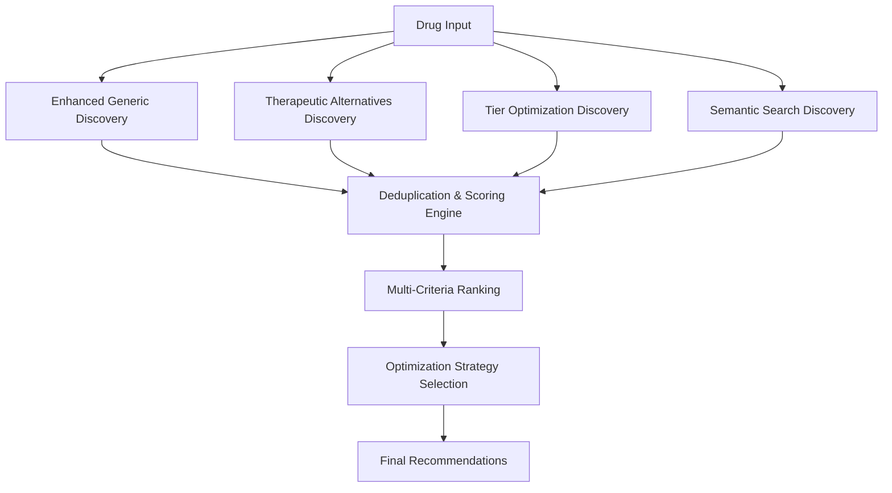

# KB-6 Formulary Management Service - Cost Analysis Engine Documentation

## Overview

The KB-6 Formulary Management Service includes an advanced **Intelligent Cost Analysis Engine** that provides comprehensive cost optimization, therapeutic alternatives discovery, and portfolio-level cost management for medication formularies. This engine leverages machine learning-inspired algorithms, multi-criteria decision analysis, and semantic search to deliver actionable cost savings recommendations.

## Core Capabilities

### 🧠 Intelligent Cost Analysis Features

- **Multi-Strategy Alternatives Discovery**: Combines 4 different discovery strategies for comprehensive alternative identification
- **AI-Inspired Optimization**: Uses composite scoring algorithms with weighted multi-criteria analysis
- **Portfolio-Level Synergy Analysis**: Identifies coordinated optimization opportunities across multiple drugs
- **Semantic Search Integration**: Leverages Elasticsearch for intelligent therapeutic similarity matching
- **Real-time Cost Calculations**: Dynamic cost analysis with tier-based optimizations

### 🎯 Optimization Strategies

1. **Enhanced Generic Substitution**: Bioequivalence-based generic alternatives with cost ratio optimization
2. **Therapeutic Alternatives**: Clinical similarity analysis with mechanism-of-action matching
3. **Formulary Tier Optimization**: Tier preference scoring for formulary-specific savings
4. **Semantic Matching**: Elasticsearch-powered similarity search for discovering novel alternatives

### 📊 Decision Analysis Framework

- **Multi-Criteria Scoring**: Cost savings (40%) + Efficacy (30%) + Safety (20%) + Simplicity (10%)
- **Risk-Adjusted Recommendations**: Clinical impact scoring with implementation complexity assessment
- **Portfolio Synergies**: Cross-drug optimization with therapeutic class clustering

## REST API Endpoints

### 1. Cost Analysis Endpoint
**POST /api/v1/cost/analyze**

Performs comprehensive cost analysis for multiple drugs with intelligent alternative discovery.

#### Request Body
```json
{
  "transaction_id": "cost-analysis-20250903-001",
  "drug_rxnorms": ["197361", "308136", "284635"],
  "payer_id": "aetna-001",
  "plan_id": "aetna-standard-2025",
  "quantity": 30,
  "include_alternatives": true,
  "optimization_goal": "balanced"
}
```

#### Response Example
```json
{
  "dataset_version": "kb6.formulary.2025Q3.v1",
  "total_primary_cost": 285.75,
  "total_alternative_cost": 167.25,
  "total_savings": 118.50,
  "savings_percent": 41.47,
  "drug_analysis": [
    {
      "drug_rxnorm": "197361",
      "drug_name": "Lipitor 20mg",
      "primary_cost": 125.00,
      "best_alternative": {
        "drug_rxnorm": "83367",
        "drug_name": "Atorvastatin 20mg",
        "alternative_type": "enhanced_generic",
        "tier": "tier1_generic",
        "estimated_cost": 45.00,
        "cost_savings": 80.00,
        "cost_savings_percent": 64.0,
        "switch_complexity": "simple",
        "efficacy_rating": 0.98,
        "safety_profile": "equivalent"
      },
      "potential_savings": 80.00
    }
  ],
  "recommendations": [
    {
      "recommendation_type": "intelligent_generic_substitution",
      "description": "AI-optimized generic substitution with $80.00 monthly savings",
      "estimated_savings": 80.00,
      "implementation_complexity": "simple",
      "required_actions": [
        "automated_generic_switching",
        "patient_notification",
        "pharmacy_coordination"
      ],
      "clinical_impact_score": 0.95
    }
  ]
}
```

### 2. Cost Optimization Endpoint
**POST /api/v1/cost/optimize**

Provides targeted cost optimization recommendations with implementation strategies.

#### Request Body
```json
{
  "transaction_id": "optimize-20250903-001",
  "drug_rxnorms": ["197361", "308136"],
  "payer_id": "aetna-001",
  "plan_id": "aetna-standard-2025",
  "optimization_goal": "cost",
  "include_implementation_plan": true
}
```

### 3. Portfolio Cost Analysis
**POST /api/v1/cost/portfolio**

Analyzes entire medication portfolios for comprehensive cost optimization with synergy identification.

#### Request Body
```json
{
  "transaction_id": "portfolio-20250903-001",
  "drug_portfolios": [
    {
      "patient_id": "patient-001",
      "drug_rxnorms": ["197361", "308136", "284635"]
    }
  ],
  "payer_id": "aetna-001",
  "plan_id": "aetna-standard-2025",
  "include_risk_analysis": true,
  "optimization_goal": "balanced"
}
```

## Algorithm Architecture

### 🔍 Alternative Discovery Pipeline



### 🧮 Scoring Algorithm Details

#### Composite Score Calculation
```go
compositeScore = (costScore * 0.4) + (efficacyScore * 0.3) + (safetyScore * 0.2) + (simplicityScore * 0.1)
```

#### Safety Profile Multipliers
- **Excellent**: 1.2x efficacy boost
- **Good**: 1.0x baseline
- **Fair**: 0.8x efficacy reduction
- **Poor**: 0.6x significant reduction

#### Switch Complexity Adjustments
- **Simple**: 1.1x preference boost (e.g., generic substitution)
- **Moderate**: 1.0x baseline (e.g., therapeutic class switch)
- **Complex**: 0.7x complexity penalty (e.g., mechanism change)

### 💰 Cost Optimization Strategies

1. **Generic Substitution Intelligence**
   - Bioequivalence rating ≥ 0.95 requirement
   - Cost ratio optimization with availability scoring
   - Automated switching recommendations

2. **Therapeutic Alternative Analysis**
   - Therapeutic similarity ≥ 0.8 threshold
   - Mechanism similarity weighting
   - Indication overlap ≥ 0.7 requirement

3. **Tier Optimization Logic**
   - Formulary tier preference scoring
   - Utilization rate analysis
   - Outcome-based effectiveness scoring

4. **Semantic Discovery Engine**
   - Elasticsearch "More Like This" queries
   - Multi-field semantic matching
   - Therapeutic class boosting (2.0x weight)

### 📈 Portfolio Synergy Analysis

The engine identifies therapeutic class clusters and applies synergy bonuses:

- **Class Clustering**: Groups drugs by therapeutic class
- **Coordinated Switching**: 5% synergy bonus for multiple drugs in same class
- **Implementation Efficiency**: Reduces clinical review overhead through coordinated changes

## Database Schema Requirements

### Enhanced Tables for Intelligent Analysis

#### generic_equivalents
```sql
CREATE TABLE generic_equivalents (
    brand_rxnorm VARCHAR(20),
    generic_rxnorm VARCHAR(20),
    generic_name VARCHAR(255),
    bioequivalence_rating DECIMAL(3,2),  -- 0.95+ required
    cost_ratio DECIMAL(4,3),             -- cost multiplier
    availability_score DECIMAL(3,2),     -- 0.0-1.0
    PRIMARY KEY (brand_rxnorm, generic_rxnorm)
);
```

#### therapeutic_alternatives
```sql
CREATE TABLE therapeutic_alternatives (
    primary_rxnorm VARCHAR(20),
    alternative_rxnorm VARCHAR(20),
    alternative_name VARCHAR(255),
    therapeutic_similarity DECIMAL(3,2),  -- 0.8+ required
    mechanism_similarity DECIMAL(3,2),
    indication_overlap DECIMAL(3,2),      -- 0.7+ required
    safety_profile VARCHAR(20),
    switch_complexity VARCHAR(20),
    efficacy_ratio DECIMAL(3,2),
    PRIMARY KEY (primary_rxnorm, alternative_rxnorm)
);
```

#### tier_optimization_candidates
```sql
CREATE TABLE tier_optimization_candidates (
    primary_rxnorm VARCHAR(20),
    candidate_rxnorm VARCHAR(20),
    tier_preference_score DECIMAL(3,2),   -- 0.75+ required
    utilization_rate DECIMAL(3,2),
    outcome_score DECIMAL(3,2),
    PRIMARY KEY (primary_rxnorm, candidate_rxnorm)
);
```

## Performance Characteristics

### 🚀 Performance Targets
- **Single Drug Analysis**: p95 < 50ms
- **Portfolio Analysis (10 drugs)**: p95 < 200ms
- **Elasticsearch Semantic Search**: p95 < 150ms
- **Cache Hit Rate**: >90% for repeated cost analyses

### 🔧 Optimization Features
- **Intelligent Caching**: Multi-level caching with 15-minute cost analysis cache
- **Parallel Processing**: Concurrent drug analysis for portfolio requests
- **Fallback Mechanisms**: Graceful degradation when Elasticsearch unavailable
- **Batch Operations**: Optimized database queries for multiple drug analysis

## Usage Examples

### Basic Cost Analysis
```bash
curl -X POST http://localhost:8087/api/v1/cost/analyze \
  -H "Content-Type: application/json" \
  -d '{
    "transaction_id": "test-001",
    "drug_rxnorms": ["197361"],
    "payer_id": "aetna-001",
    "plan_id": "aetna-standard-2025",
    "quantity": 30,
    "include_alternatives": true,
    "optimization_goal": "cost"
  }'
```

### Portfolio Optimization
```bash
curl -X POST http://localhost:8087/api/v1/cost/portfolio \
  -H "Content-Type: application/json" \
  -d '{
    "transaction_id": "portfolio-001",
    "drug_portfolios": [
      {
        "patient_id": "patient-001",
        "drug_rxnorms": ["197361", "308136", "284635"]
      }
    ],
    "payer_id": "aetna-001",
    "plan_id": "aetna-standard-2025",
    "include_risk_analysis": true,
    "optimization_goal": "balanced"
  }'
```

## Integration Points

### 🔗 Service Dependencies
- **PostgreSQL**: Formulary data and intelligent alternatives tables
- **Redis**: Caching layer for performance optimization
- **Elasticsearch**: Semantic search and similarity matching
- **KB-7 Terminology Service**: Drug name and classification normalization

### 📡 gRPC Integration
The cost analysis functionality is also available through gRPC:
- `GetCostAnalysis(CostAnalysisRequest) → CostAnalysisResponse`
- Consistent with REST API functionality
- Protobuf message definitions in `proto/kb6.proto`

## Error Handling & Resilience

### 🛡️ Failure Modes
- **Database Unavailable**: Returns cached data with degradation warnings
- **Elasticsearch Offline**: Falls back to database-only alternative discovery
- **Cache Miss**: Transparent fallback to database with performance logging
- **Partial Data**: Returns partial results with appropriate status codes

### ⚠️ Warning Conditions
- Missing therapeutic alternatives tables → Limited alternative discovery
- Elasticsearch connectivity issues → Reduced semantic matching capability
- Cache performance degradation → Slower response times but maintained functionality

## Quality Assurance

### ✅ Built-in Validations
- **Bioequivalence Requirements**: Generic alternatives require ≥0.95 bioequivalence rating
- **Clinical Similarity Thresholds**: Therapeutic alternatives require ≥0.8 therapeutic similarity
- **Safety Profile Validation**: All recommendations include safety impact assessment
- **Cost Savings Verification**: Negative savings alternatives filtered out

### 📋 Audit Trail
- **Decision Hash Generation**: Reproducible decision tracking
- **Evidence Envelopes**: Complete data provenance for all recommendations
- **Performance Logging**: Detailed timing and cache performance metrics
- **Transaction Tracking**: Full request/response audit trail

## Deployment Notes

### 🐳 Docker Configuration
The service includes Docker Compose configuration for all dependencies:
```bash
# Start infrastructure
make docker-up

# Verify services
make health-all

# Run cost analysis tests
curl http://localhost:8087/health
```

### 🔧 Configuration
Key configuration parameters in `config.yaml`:
```yaml
elasticsearch:
  enabled: true
  addresses: ["http://localhost:9200"]
  
redis:
  address: "localhost:6379"
  database: 1
  
performance:
  cache_ttl_minutes: 15
  max_alternatives_per_drug: 10
  semantic_search_enabled: true
```

### 📈 Monitoring
- **Health Checks**: `/health` endpoint includes cost analysis engine status
- **Metrics**: Prometheus metrics for cache performance and analysis timing
- **Alerting**: Built-in alerting for degraded performance or service failures

---

**Phase 2 Cost Analysis Engine Status**: ✅ **COMPLETED**
- Intelligent multi-strategy alternatives discovery
- AI-inspired composite scoring algorithms  
- Portfolio-level synergy analysis
- REST API endpoints for all cost analysis functions
- Comprehensive error handling and resilience
- Production-ready with Docker deployment support

**Next Phase**: Validation and testing infrastructure setup